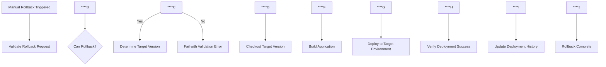

#**Rollback Guide

This guide explains the rollback capabilities for pre-production and production deployments in the shared CI/CD workflow.

## Rollback Features

### Manual Rollback
- On-demand rollback via manual workflow dispatch
- Can specify target version or use last successful deployment
- Requires reason for rollback (audit purposes)
- Available for all environments (development, staging, pre-production, production)

## How to Perform Manual Rollback

### 1. Access Manual Rollback Workflow

1. Go to your shared CI/CD repository
2. Navigate to **Actions** tab
3. Select **Manual Rollback** workflow
4. Click **Run workflow

### 2. Configure Rollback Parameters

| Parameter | Description | Required | Options |
|-----------|-------------|----------|---------|
| `environment` | Target environment to rollback |**Yes | `pre-production`, `production` |
| `target_version` | Specific version to rollback to |**Optional | Git SHA, tag, or branch name |
| `reason` | Reason for rollback |**Yes | Free text (for audit trail) |

### 3. Rollback Process



## Manual Rollback Process

### Execution Steps
1. **Validate Request**: Checks environment and target version
2. **Version Resolution**: Determines exact version to rollback to
3. **Fresh Checkout**: Retrieves source code for target version
4. **Build Process**: Performs fresh build of target version
5. **Deploy Rollback**: Deploys new build to specified environment
6. **Update Status**: Records rollback in deployment history

## Rollback Validation

### Pre-Rollback Checks
- Target environment has active deployment
- Previous successful deployment exists
- Target version is different from current version
- Required secrets and tokens are available
- Source code for target version is available

### Validation Failures
- No deployment history found
- No previous successful deployment
- Target version same as current version
- Missing deployment tokens
- Build artifacts unavailable

## Security and Compliance

### Environment Protection
- Pre-production rollbacks require **pre-production** environment approval
- Production rollbacks require **production** environment approval
- Rollback permissions inherit from deployment permissions

### Audit Trail
- All rollbacks logged in GitHub deployment history
- Rollback reason captured in workflow logs
- Actor (who triggered rollback) recorded
- Timestamps for all rollback activities

### Version Control
- Rollback targets must exist in Git history
- Rollback builds use exact code from target version
- No code changes allowed during rollback process

## Monitoring and Notifications

### Rollback Success
```
 Rollback completed successfully
 Rolled back from: v2.1.0 
 Rolled back to: v2.0.5
 URL: https://your-app.azurestaticapps.net
```

### Rollback Failure
```
 Rollback failed - manual intervention required
Environment: production
Target Version: v2.0.5
Error: Azure deployment timeout
```

### Notification Integration
- Successful rollbacks trigger team notifications
- Failed rollbacks trigger urgent alerts
- Rollback summaries included in deployment reports

## Troubleshooting

### Common Issues

#### "No previous version found for rollback"
```bash
# Cause: No successful deployment history
# Solution: Ensure at least one successful deployment exists
# Workaround: Specify target_version manually
```

#### "Azure deployment timeout"
```bash
# Cause: Azure Static Web Apps service issues
# Solution: Retry rollback after Azure service recovery
# Escalation: Contact Azure support if persistent
```

#### "Build artifacts not found"
```bash
# Cause: Artifacts expired or not uploaded
# Solution: Trigger fresh build for target version
# Prevention: Increase artifact retention period
```

#### "Permission denied"
```bash
# Cause: Missing environment approval or secrets
# Solution: Verify environment protection rules
# Check: Azure Static Web Apps API tokens
```

### Emergency Procedures

#### Rollback Failed - Manual Intervention
1. **Immediate**: Stop traffic to affected environment
2. **Assess**: Check Azure Static Web Apps portal for deployment status
3. **Manual Deploy**: Use Azure CLI or portal for emergency deployment
4. **Document**: Record manual actions for post-incident review

#### Multiple Environment Failures
1. **Isolate**: Identify common failure cause
2. **Rollback**: Start with production, then pre-production
3. **Investigate**: Check shared dependencies (secrets, Azure services)
4. **Communicate**: Notify stakeholders of multi-environment incident

## Best Practices

### Rollback Strategy
- **Test rollback procedures** regularly in non-production environments
- **Maintain deployment history** with adequate artifact retention
- **Document rollback reasons** for post-incident analysis
- **Monitor post-rollback** application health and metrics

### Prevention
- **Blue-green deployments** for zero-downtime updates
- **Canary releases** for gradual rollouts
- **Feature flags** for quick feature disabling
- **Comprehensive testing** before production deployments

### Recovery Planning
- **Define RTO/RPO** for each environment
- **Establish escalation paths** for rollback failures
- **Train team members** on rollback procedures
- **Regular disaster recovery drills** including rollback scenarios

## Support and Escalation

### First Level: Self-Service
1. Check this rollback guide
2. Review workflow logs in GitHub Actions
3. Verify environment permissions and secrets
4. Attempt manual rollback with different target version

### Second Level: DevOps Team
1. Create issue in shared CI/CD repository
2. Include rollback workflow run URL
3. Provide environment and failure details
4. Specify business impact and urgency

### Third Level: Emergency
1. Contact on-call DevOps engineer
2. Escalate to Azure support if infrastructure-related
3. Initiate incident response procedures
4. Consider manual Azure portal deployment

---

## 🔗 Related Documentation

- [Shared Workflow Variables Guide](SHARED_WORKFLOW_VARIABLES.md)
- [Azure Deployment Troubleshooting](AZURE_DEPLOYMENT_TROUBLESHOOTING.md)
- [Frontend Integration Guide](FRONTEND_INTEGRATION_GUIDE.md)
- [Complete Centralization Summary](COMPLETE_CENTRALIZATION_SUMMARY.md)

**Remember**: Rollbacks are a safety net, not a substitute for proper testing and deployment practices!