# 🔄 Rollback Guide

This guide explains the rollback capabilities for pre-production and production deployments in the shared CI/CD workflow.

## 🎯 Rollback Features

### **Automatic Rollback**
- Triggers automatically when pre-production or production deployments fail
- Uses the last successful deployment version
- Maintains deployment history and audit trail

### **Manual Rollback**
- On-demand rollback via manual workflow dispatch
- Can specify target version or use last successful deployment
- Requires reason for rollback (audit purposes)
- Available for pre-production and production environments only

## 🚀 How to Perform Manual Rollback

### **1. Access Manual Rollback Workflow**

1. Go to your shared CI/CD repository
2. Navigate to **Actions** tab
3. Select **Manual Rollback** workflow
4. Click **Run workflow**

### **2. Configure Rollback Parameters**

| Parameter | Description | Required | Options |
|-----------|-------------|----------|---------|
| `environment` | Target environment to rollback | ✅ Yes | `pre-production`, `production` |
| `target_version` | Specific version to rollback to | ❌ Optional | Git SHA, tag, or branch name |
| `reason` | Reason for rollback | ✅ Yes | Free text (for audit trail) |

### **3. Rollback Process**

```mermaid
graph TD
    A[Manual Rollback Triggered] --> B[Validate Rollback Request]
    B --> C{Can Rollback?}
    C -->|Yes| D[Determine Target Version]
    C -->|No| E[❌ Fail with Validation Error]
    D --> F[Checkout Target Version]
    F --> G[Build Application]
    G --> H[Deploy to Target Environment]
    H --> I[Verify Deployment Success]
    I --> J[Update Deployment History]
    J --> K[✅ Rollback Complete]
```



## ⚙️ Automatic Rollback Behavior

### **Trigger Conditions**
- Pre-production deployment fails
- Production deployment fails
- Quality gates fail after deployment

### **Rollback Process**
1. **Detect Failure**: Monitors deployment job outcomes
2. **Find Previous Version**: Queries GitHub deployment API for last successful deployment
3. **Download Artifacts**: Retrieves build artifacts from previous successful build
4. **Perform Rollback**: Deploys previous version to failed environment
5. **Verify Success**: Confirms rollback deployment completed successfully
6. **Update Status**: Records rollback in deployment history

## 📋 Rollback Validation

### **Pre-Rollback Checks**
- ✅ Target environment has active deployment
- ✅ Previous successful deployment exists
- ✅ Target version is different from current version
- ✅ Required secrets and tokens are available
- ✅ Build artifacts are accessible

### **Validation Failures**
- ❌ No deployment history found
- ❌ No previous successful deployment
- ❌ Target version same as current version
- ❌ Missing deployment tokens
- ❌ Build artifacts unavailable

## 🛡️ Security and Compliance

### **Environment Protection**
- Pre-production rollbacks require **pre-production** environment approval
- Production rollbacks require **production** environment approval
- Rollback permissions inherit from deployment permissions

### **Audit Trail**
- All rollbacks logged in GitHub deployment history
- Rollback reason captured in workflow logs
- Actor (who triggered rollback) recorded
- Timestamps for all rollback activities

### **Version Control**
- Rollback targets must exist in Git history
- Rollback builds use exact code from target version
- No code changes allowed during rollback process

## 📊 Monitoring and Notifications

### **Rollback Success**
```
✅ Rollback completed successfully
🔄 Rolled back from: v2.1.0 
📍 Rolled back to: v2.0.5
🌐 URL: https://your-app.azurestaticapps.net
```

### **Rollback Failure**
```
❌ Rollback failed - manual intervention required
Environment: production
Target Version: v2.0.5
Error: Azure deployment timeout
```

### **Notification Integration**
- Successful rollbacks trigger team notifications
- Failed rollbacks trigger urgent alerts
- Rollback summaries included in deployment reports

## 🔧 Troubleshooting

### **Common Issues**

#### **"No previous version found for rollback"**
```bash
# Cause: No successful deployment history
# Solution: Ensure at least one successful deployment exists
# Workaround: Specify target_version manually
```

#### **"Azure deployment timeout"**
```bash
# Cause: Azure Static Web Apps service issues
# Solution: Retry rollback after Azure service recovery
# Escalation: Contact Azure support if persistent
```

#### **"Build artifacts not found"**
```bash
# Cause: Artifacts expired or not uploaded
# Solution: Trigger fresh build for target version
# Prevention: Increase artifact retention period
```

#### **"Permission denied"**
```bash
# Cause: Missing environment approval or secrets
# Solution: Verify environment protection rules
# Check: Azure Static Web Apps API tokens
```

### **Emergency Procedures**

#### **Rollback Failed - Manual Intervention**
1. **Immediate**: Stop traffic to affected environment
2. **Assess**: Check Azure Static Web Apps portal for deployment status
3. **Manual Deploy**: Use Azure CLI or portal for emergency deployment
4. **Document**: Record manual actions for post-incident review

#### **Multiple Environment Failures**
1. **Isolate**: Identify common failure cause
2. **Rollback**: Start with production, then pre-production
3. **Investigate**: Check shared dependencies (secrets, Azure services)
4. **Communicate**: Notify stakeholders of multi-environment incident

## 📈 Best Practices

### **Rollback Strategy**
- ✅ **Test rollback procedures** regularly in non-production environments
- ✅ **Maintain deployment history** with adequate artifact retention
- ✅ **Document rollback reasons** for post-incident analysis
- ✅ **Monitor post-rollback** application health and metrics

### **Prevention**
- ✅ **Blue-green deployments** for zero-downtime updates
- ✅ **Canary releases** for gradual rollouts
- ✅ **Feature flags** for quick feature disabling
- ✅ **Comprehensive testing** before production deployments

### **Recovery Planning**
- ✅ **Define RTO/RPO** for each environment
- ✅ **Establish escalation paths** for rollback failures
- ✅ **Train team members** on rollback procedures
- ✅ **Regular disaster recovery drills** including rollback scenarios

## 📞 Support and Escalation

### **First Level: Self-Service**
1. Check this rollback guide
2. Review workflow logs in GitHub Actions
3. Verify environment permissions and secrets
4. Attempt manual rollback with different target version

### **Second Level: DevOps Team**
1. Create issue in shared CI/CD repository
2. Include rollback workflow run URL
3. Provide environment and failure details
4. Specify business impact and urgency

### **Third Level: Emergency**
1. Contact on-call DevOps engineer
2. Escalate to Azure support if infrastructure-related
3. Initiate incident response procedures
4. Consider manual Azure portal deployment

---

## 🔗 Related Documentation

- [Shared Workflow Variables Guide](SHARED_WORKFLOW_VARIABLES.md)
- [Azure Deployment Troubleshooting](AZURE_DEPLOYMENT_TROUBLESHOOTING.md)
- [Frontend Integration Guide](FRONTEND_INTEGRATION_GUIDE.md)
- [Complete Centralization Summary](COMPLETE_CENTRALIZATION_SUMMARY.md)

**Remember**: Rollbacks are a safety net, not a substitute for proper testing and deployment practices!