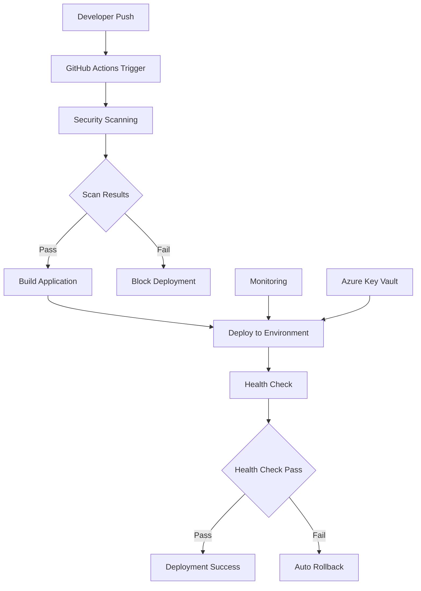

# 🚀 Deployment Guide

This guide provides comprehensive deployment procedures and scenario-based examples for Azure Static Web Apps across multiple environments.

## 📋 Table of Contents

1. [Overview](#overview)
2. [Deployment Types](#deployment-types)
3. [Deployment Scenarios](#deployment-scenarios)
4. [Manual Deployment](#manual-deployment)
5. [Automated Deployment](#automated-deployment)
6. [Rollback Procedures](#rollback-procedures)
7. [Monitoring Deployments](#monitoring-deployments)
8. [Troubleshooting](#troubleshooting)

## 🎯 Overview

This deployment system supports multiple deployment strategies across four environments with integrated monitoring, security scanning, and rollback capabilities.

### Deployment Flow



## 🎯 Deployment Types

### 1. **Branch-Based Deployment**
- **Development**: Triggered on push to `develop` branch
- **Staging**: Triggered on push to `staging` branch
- **Pre-Production**: Triggered on push to `preprod` branch
- **Production**: Triggered on push to `main` branch

### 2. **Tag-Based Deployment**
- **Production**: Triggered on semantic version tags (v1.0.0, v1.1.0, etc.)
- **Pre-Production**: Triggered on release candidate tags (v1.0.0-rc.1)

### 3. **Manual Deployment**
- **Any Environment**: Manual workflow dispatch
- **Emergency Deployment**: Fast-track deployment bypassing some checks

## 📖 Deployment Scenarios

### Scenario 1: Feature Development

**Use Case**: Developer working on a new feature

```bash
# 1. Create feature branch
git checkout -b feature/user-authentication
git push -u origin feature/user-authentication

# 2. Make changes and commit
git add .
git commit -m "feat: add user authentication system"
git push origin feature/user-authentication

# 3. Create pull request to develop
gh pr create --title "Add user authentication" --body "Implements JWT-based authentication" --base develop

# 4. After PR approval, merge triggers dev deployment
```

**Expected Flow**:
1. ✅ PR created with security checks
2. ✅ SonarCloud and Checkmarx scanning
3. ✅ Automated deployment to development environment
4. ✅ Health checks validate deployment
5. ✅ Monitoring alerts activated

### Scenario 2: Staging Release

**Use Case**: Preparing for production release

```bash
# 1. Merge multiple features to staging
git checkout staging
git merge develop
git push origin staging

# 2. Deployment automatically triggers
# 3. Run integration tests
npm run test:e2e:staging

# 4. Validate with stakeholders
```

**Expected Flow**:
1. ✅ Automated deployment to staging environment
2. ✅ Integration tests execution
3. ✅ Stakeholder validation
4. ✅ Performance testing with Lighthouse
5. ✅ User acceptance testing

### Scenario 3: Production Release

**Use Case**: Deploying to production

```bash
# 1. Create release branch
git checkout -b release/v1.2.0
git push -u origin release/v1.2.0

# 2. Deploy to pre-production first
git checkout preprod
git merge release/v1.2.0
git push origin preprod

# 3. After validation, deploy to production
git checkout main
git merge release/v1.2.0
git tag v1.2.0
git push origin main --tags
```

**Expected Flow**:
1. ✅ Pre-production deployment and validation
2. ✅ Enhanced security scanning
3. ✅ Production deployment with blue-green strategy
4. ✅ Comprehensive health checks
5. ✅ Monitoring and alerting activation

### Scenario 4: Hotfix Deployment

**Use Case**: Critical bug fix in production

```bash
# 1. Create hotfix branch from main
git checkout main
git checkout -b hotfix/critical-security-fix

# 2. Make minimal changes
git add .
git commit -m "fix: resolve critical security vulnerability"
git push -u origin hotfix/critical-security-fix

# 3. Emergency deployment
gh workflow run enhanced-ci-cd.yml --ref hotfix/critical-security-fix \
  -f environment=production \
  -f emergency_deployment=true
```

**Expected Flow**:
1. ✅ Emergency workflow with reduced checks
2. ✅ Critical security scanning only
3. ✅ Direct production deployment
4. ✅ Enhanced monitoring during deployment
5. ✅ Immediate health verification

### Scenario 5: Rollback Scenario

**Use Case**: Production deployment issues

```bash
# 1. Detect issue through monitoring
# 2. Trigger automated rollback
gh workflow run enhanced-ci-cd.yml \
  -f environment=production \
  -f rollback=true \
  -f rollback_version=v1.1.9

# 3. Or use rollback script
npm run rollback:production -- --version=v1.1.9
```

**Expected Flow**:
1. ✅ Issue detection via monitoring alerts
2. ✅ Automated rollback to previous stable version
3. ✅ Health check validation of rollback
4. ✅ Incident response procedures
5. ✅ Post-mortem analysis

## 🔧 Manual Deployment

### Deploy to Specific Environment

```bash
# Deploy current branch to development
gh workflow run enhanced-ci-cd.yml \
  --ref $(git branch --show-current) \
  -f environment=development \
  -f enable_monitoring=true

# Deploy with specific configuration
gh workflow run enhanced-ci-cd.yml \
  --ref main \
  -f environment=production \
  -f enable_sonar=true \
  -f enable_checkmarx=true \
  -f enable_monitoring=true \
  -f performance_budget=true
```

### Emergency Deployment

```bash
# Emergency deployment bypassing some checks
gh workflow run enhanced-ci-cd.yml \
  --ref hotfix/critical-fix \
  -f environment=production \
  -f emergency_deployment=true \
  -f skip_tests=false \
  -f enable_monitoring=true
```

### Deploy Specific Version

```bash
# Deploy specific tag to production
gh workflow run enhanced-ci-cd.yml \
  --ref v1.2.0 \
  -f environment=production \
  -f deployment_type=tag
```

## 🤖 Automated Deployment

### GitHub Actions Configuration

The deployment system uses multiple GitHub Actions workflows:

#### 1. **Enhanced CI/CD Workflow** (`.github/workflows/enhanced-ci-cd.yml`)

```yaml
# Trigger Configuration
on:
  push:
    branches: [main, develop, staging, preprod]
    tags: ['v*']
  pull_request:
    branches: [main, develop]
  workflow_dispatch:
    inputs:
      environment:
        description: 'Target environment'
        required: true
        default: 'development'
        type: choice
        options:
        - development
        - staging
        - pre-production
        - production
      emergency_deployment:
        description: 'Emergency deployment'
        required: false
        default: false
        type: boolean
```

#### 2. **Deployment Steps**

```yaml
# Build with Environment Variables
- name: Build Application
  run: |
    export REACT_APP_VERSION=${{ steps.version.outputs.version }}
    export REACT_APP_BUILD_ID="${{ github.run_number }}"
    export REACT_APP_BUILD_DATE=$(date -u +"%Y-%m-%dT%H:%M:%SZ")
    export REACT_APP_GIT_COMMIT="${{ github.sha }}"
    export REACT_APP_GIT_BRANCH="${{ github.ref_name }}"
    export REACT_APP_ENV="${{ matrix.environment }}"
    npm run build:prod

# Deploy with Health Checks
- name: Deploy to Azure Static Web Apps
  uses: ./.github/actions/enhanced-deploy
  with:
    app_location: '.'
    build_location: 'build'
    environment: ${{ matrix.environment }}
    azure_static_web_apps_api_token: ${{ secrets.AZURE_STATIC_WEB_APPS_API_TOKEN }}
    enable_health_check: true
    enable_monitoring: true
    enable_rollback: true
```

### Environment-Specific Configurations

#### Development Environment
```yaml
development:
  auto_deploy: true
  health_check_timeout: 60
  rollback_enabled: true
  monitoring_level: basic
  performance_budget: false
```

#### Staging Environment
```yaml
staging:
  auto_deploy: true
  health_check_timeout: 120
  rollback_enabled: true
  monitoring_level: enhanced
  performance_budget: true
  integration_tests: true
```

#### Production Environment
```yaml
production:
  auto_deploy: false  # Requires manual approval
  health_check_timeout: 300
  rollback_enabled: true
  monitoring_level: comprehensive
  performance_budget: true
  security_scanning: required
  approval_required: true
```

## ⏪ Rollback Procedures

### Automated Rollback

The system supports automatic rollback based on health check failures:

```javascript
// Health Check Configuration
{
  "healthCheck": {
    "enabled": true,
    "timeout": 300,
    "retries": 3,
    "endpoints": [
      "/api/health",
      "/api/version",
      "/"
    ],
    "thresholds": {
      "responseTime": 2000,
      "errorRate": 5,
      "availability": 99
    }
  },
  "rollback": {
    "enabled": true,
    "trigger": "health_check_failure",
    "strategy": "previous_version",
    "confirmation_required": false
  }
}
```

### Manual Rollback

#### Using Rollback Script

```bash
# Rollback to previous version
npm run rollback:production

# Rollback to specific version
npm run rollback:production -- --version=v1.1.9

# Rollback with confirmation
npm run rollback:production -- --version=v1.1.9 --confirm
```

#### Using GitHub Actions

```bash
# Trigger rollback workflow
gh workflow run enhanced-ci-cd.yml \
  -f environment=production \
  -f action=rollback \
  -f rollback_version=v1.1.9 \
  -f reason="Performance issues detected"
```

### Rollback Verification

```bash
# Verify rollback success
curl -f https://yourdomain.com/api/version
curl -f https://yourdomain.com/api/health

# Check deployment history
az staticwebapp show \
  --name "myapp-swa-prod-eastus2" \
  --resource-group "myapp-rg-prod-eastus2" \
  --query "defaultHostname"
```

## 📊 Monitoring Deployments

### Real-time Deployment Monitoring

```bash
# Monitor deployment progress
gh run list --workflow=enhanced-ci-cd.yml --limit=5

# Watch specific deployment
gh run watch $(gh run list --workflow=enhanced-ci-cd.yml --limit=1 --json databaseId --jq '.[0].databaseId')

# Check deployment logs
gh run view $(gh run list --workflow=enhanced-ci-cd.yml --limit=1 --json databaseId --jq '.[0].databaseId') --log
```

### Health Check Monitoring

```bash
# Run health check manually
npm run health-check -- --environment=production

# Monitor health metrics
npm run monitoring -- --environment=production --watch

# Check Application Insights
az monitor app-insights component show \
  --app "myapp-ai-prod-eastus2" \
  --resource-group "myapp-rg-prod-eastus2"
```

### Deployment Notifications

Configure Slack/Teams notifications:

```yaml
# Slack Notification
- name: Notify Slack
  if: always()
  uses: 8398a7/action-slack@v3
  with:
    status: ${{ job.status }}
    channel: '#deployments'
    text: |
      Deployment to ${{ matrix.environment }} ${{ job.status }}
      Version: ${{ steps.version.outputs.version }}
      Commit: ${{ github.sha }}
      Branch: ${{ github.ref_name }}
  env:
    SLACK_WEBHOOK_URL: ${{ secrets.SLACK_WEBHOOK }}
```

## 🔍 Deployment Verification

### Automated Verification

```bash
# Post-deployment verification script
#!/bin/bash
ENVIRONMENT=$1
BASE_URL=$2

echo "🔍 Verifying deployment to $ENVIRONMENT"

# Health check
HTTP_STATUS=$(curl -s -o /dev/null -w "%{http_code}" "$BASE_URL/api/health")
if [ "$HTTP_STATUS" = "200" ]; then
    echo "✅ Health check passed"
else
    echo "❌ Health check failed (HTTP $HTTP_STATUS)"
    exit 1
fi

# Version check
DEPLOYED_VERSION=$(curl -s "$BASE_URL/api/version" | jq -r '.version')
echo "📋 Deployed version: $DEPLOYED_VERSION"

# Performance check
RESPONSE_TIME=$(curl -w "%{time_total}" -s -o /dev/null "$BASE_URL")
if (( $(echo "$RESPONSE_TIME < 2.0" | bc -l) )); then
    echo "✅ Performance check passed ($RESPONSE_TIME seconds)"
else
    echo "⚠️ Performance check warning ($RESPONSE_TIME seconds)"
fi

echo "🎉 Deployment verification completed"
```

### Manual Verification Checklist

#### Development Environment
- [ ] Application loads successfully
- [ ] Health endpoints respond correctly
- [ ] Basic functionality works
- [ ] Console logs are clean
- [ ] No critical errors in monitoring

#### Staging Environment
- [ ] All development checks pass
- [ ] Integration tests complete successfully
- [ ] Performance meets baseline requirements
- [ ] Security scanning shows no critical issues
- [ ] User acceptance testing can proceed

#### Production Environment
- [ ] All staging checks pass
- [ ] Performance meets production standards
- [ ] Security scanning passes all checks
- [ ] Monitoring and alerting are active
- [ ] Business stakeholder approval received
- [ ] Rollback plan is ready

## 🚨 Troubleshooting

### Common Deployment Issues

#### 1. **Build Failures**

```bash
# Check build logs
gh run view --log | grep -A 10 -B 10 "Build failed"

# Local build test
npm run build:prod
npm run serve

# Check environment variables
env | grep REACT_APP_
```

#### 2. **Deployment Token Issues**

```bash
# Regenerate deployment token
az staticwebapp secrets list \
  --name "myapp-swa-prod-eastus2" \
  --resource-group "myapp-rg-prod-eastus2"

# Update GitHub secret
gh secret set AZURE_STATIC_WEB_APPS_API_TOKEN_PROD --body "new-token"
```

#### 3. **Health Check Failures**

```bash
# Check health endpoint manually
curl -v https://yourdomain.com/api/health

# Check Application Insights logs
az monitor app-insights query \
  --app "myapp-ai-prod-eastus2" \
  --analytics-query "requests | where timestamp > ago(1h) | where url contains 'health'"
```

#### 4. **DNS/Domain Issues**

```bash
# Check DNS resolution
nslookup yourdomain.com
dig yourdomain.com

# Check SSL certificate
openssl s_client -connect yourdomain.com:443 -servername yourdomain.com
```

### Emergency Procedures

#### 1. **Quick Rollback**

```bash
# Immediate rollback to last known good version
npm run emergency-rollback -- --environment=production

# Bypass health checks if needed
npm run emergency-rollback -- --environment=production --force
```

#### 2. **Deployment Freeze**

```bash
# Disable automatic deployments
gh api repos/owner/repo/actions/workflows/enhanced-ci-cd.yml --method PUT \
  --field state=disabled

# Re-enable when ready
gh api repos/owner/repo/actions/workflows/enhanced-ci-cd.yml --method PUT \
  --field state=active
```

## 📝 Best Practices

### 1. **Pre-Deployment**
- Always test in lower environments first
- Verify environment-specific configurations
- Check dependency versions and compatibility
- Review security scan results
- Ensure rollback plan is ready

### 2. **During Deployment**
- Monitor deployment progress actively
- Watch health check metrics
- Be ready to trigger rollback if needed
- Communicate with stakeholders

### 3. **Post-Deployment**
- Verify all functionality works correctly
- Monitor performance metrics
- Check error rates and logs
- Update documentation if needed
- Conduct retrospective if issues occurred

## 🔗 Related Documentation

- [Infrastructure Setup Guide](./01-INFRASTRUCTURE-SETUP.md)
- [Environment Configuration](./03-ENVIRONMENT-CONFIGURATION.md)
- [Monitoring Guide](./05-MONITORING-GUIDE.md)
- [Troubleshooting Guide](./07-TROUBLESHOOTING.md)

---

**Last Updated:** December 2024  
**Version:** 1.0.0