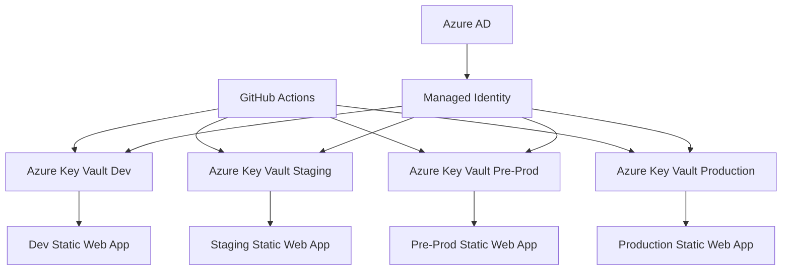

# 🔐 Azure Key Vault Integration Guide

This guide provides comprehensive instructions for integrating Azure Key Vault with different environments for secret management across the Azure Static Web Apps deployment system.

## 📋 Table of Contents

1. [Overview](#overview)
2. [Azure Key Vault Setup](#azure-key-vault-setup)
3. [Environment-Specific Key Vaults](#environment-specific-key-vaults)
4. [Secret Management](#secret-management)
5. [GitHub Actions Integration](#github-actions-integration)
6. [Access Control & Permissions](#access-control--permissions)
7. [Secret Rotation](#secret-rotation)
8. [Monitoring & Auditing](#monitoring--auditing)

## 🎯 Overview

Azure Key Vault provides centralized secret management for all environments with:

- **Environment Isolation** - Separate Key Vaults for each environment
- **Access Control** - Role-based access with managed identities
- **Secret Rotation** - Automated secret rotation capabilities
- **Audit Logging** - Complete audit trail for all secret operations
- **Integration** - Seamless integration with GitHub Actions and Azure services

### Architecture Overview



## 🏗️ Azure Key Vault Setup

### Step 1: Create Key Vaults for Each Environment

```bash
# Set project variables
PROJECT_NAME="myapp"
LOCATION="East US 2"
LOCATION_SHORT="eastus2"
SUBSCRIPTION_ID="your-subscription-id"

# Define environments
environments=("dev" "staging" "preprod" "prod")

# Create Key Vaults
for env in "${environments[@]}"; do
    RG_NAME="${PROJECT_NAME}-rg-${env}-${LOCATION_SHORT}"
    KV_NAME="${PROJECT_NAME}-kv-${env}-${LOCATION_SHORT}"
    
    echo "Creating Key Vault: $KV_NAME"
    az keyvault create \
        --name "$KV_NAME" \
        --resource-group "$RG_NAME" \
        --location "$LOCATION" \
        --sku Standard \
        --enabled-for-deployment true \
        --enabled-for-disk-encryption true \
        --enabled-for-template-deployment true \
        --enable-soft-delete true \
        --soft-delete-retention-days 90 \
        --enable-purge-protection true \
        --tags \
            Environment="$env" \
            Project="$PROJECT_NAME" \
            CreatedDate="$(date -u +%Y-%m-%d)" \
            Purpose="Secret Management"
    
    echo "✅ Key Vault $KV_NAME created"
done
```

### Step 2: Configure Access Policies

```bash
# Get current user object ID
CURRENT_USER_ID=$(az ad signed-in-user show --query objectId --output tsv)

# Set access policies for current user (admin access)
for env in "${environments[@]}"; do
    KV_NAME="${PROJECT_NAME}-kv-${env}-${LOCATION_SHORT}"
    
    echo "Setting admin access policy for $KV_NAME"
    az keyvault set-policy \
        --name "$KV_NAME" \
        --object-id "$CURRENT_USER_ID" \
        --secret-permissions get list set delete recover backup restore \
        --key-permissions get list create delete recover backup restore \
        --certificate-permissions get list create delete recover backup restore
        
    echo "✅ Admin access configured for $KV_NAME"
done
```

### Step 3: Configure Managed Identity for GitHub Runners

```bash
# Ensure GitHub Actions runners have managed identity configured
# This is typically done during the runner deployment

# Verify managed identity authentication
echo "Verifying managed identity authentication..."
if az account show >/dev/null 2>&1; then
    echo "✅ Managed identity is configured and working"
    SUBSCRIPTION_ID=$(az account show --query id -o tsv)
    echo "Current subscription: ${SUBSCRIPTION_ID:0:8}****"
else
    echo "❌ Managed identity not configured"
    echo "Please ensure GitHub Actions runners have managed identity enabled"
    exit 1
fi

# Get the managed identity object ID
MANAGED_IDENTITY_ID=$(az account show --query user.name -o tsv)
echo "Managed Identity ID: $MANAGED_IDENTITY_ID"
```

### Step 4: Grant Key Vault Access to Managed Identity

```bash
# Grant Key Vault access to GitHub Actions managed identity
for env in "${environments[@]}"; do
    KV_NAME="${PROJECT_NAME}-kv-${env}-${LOCATION_SHORT}"
    
    echo "Granting Key Vault access to managed identity for $KV_NAME"
    
    # Option 1: Using Azure RBAC (recommended)
    az role assignment create \
        --assignee "$MANAGED_IDENTITY_ID" \
        --role "Key Vault Secrets User" \
        --scope "/subscriptions/$SUBSCRIPTION_ID/resourceGroups/${PROJECT_NAME}-rg-${env}-${LOCATION_SHORT}/providers/Microsoft.KeyVault/vaults/$KV_NAME"
    
    # Option 2: Using Access Policies (alternative)
    # az keyvault set-policy \
    #     --name "$KV_NAME" \
    #     --object-id "$MANAGED_IDENTITY_OBJECT_ID" \
    #     --secret-permissions get list
        
    echo "✅ Managed identity access configured for $KV_NAME"
done
```

## 🌍 Environment-Specific Key Vaults

### Development Environment Key Vault

```bash
KV_DEV="${PROJECT_NAME}-kv-dev-${LOCATION_SHORT}"

# Development-specific secrets
az keyvault secret set --vault-name "$KV_DEV" --name "API-Key" --value "dev-api-key-value"
az keyvault secret set --vault-name "$KV_DEV" --name "Database-ConnectionString" --value "Server=dev-db;Database=myapp;..."
az keyvault secret set --vault-name "$KV_DEV" --name "Storage-ConnectionString" --value "DefaultEndpointsProtocol=https;AccountName=devstg..."
az keyvault secret set --vault-name "$KV_DEV" --name "ApplicationInsights-InstrumentationKey" --value "dev-ai-key"
az keyvault secret set --vault-name "$KV_DEV" --name "JWT-Secret" --value "dev-jwt-secret-key"
az keyvault secret set --vault-name "$KV_DEV" --name "External-API-Key" --value "dev-external-api-key"

echo "✅ Development secrets configured"
```

### Staging Environment Key Vault

```bash
KV_STAGING="${PROJECT_NAME}-kv-staging-${LOCATION_SHORT}"

# Staging-specific secrets
az keyvault secret set --vault-name "$KV_STAGING" --name "API-Key" --value "staging-api-key-value"
az keyvault secret set --vault-name "$KV_STAGING" --name "Database-ConnectionString" --value "Server=staging-db;Database=myapp;..."
az keyvault secret set --vault-name "$KV_STAGING" --name "Storage-ConnectionString" --value "DefaultEndpointsProtocol=https;AccountName=stagingstg..."
az keyvault secret set --vault-name "$KV_STAGING" --name "ApplicationInsights-InstrumentationKey" --value "staging-ai-key"
az keyvault secret set --vault-name "$KV_STAGING" --name "JWT-Secret" --value "staging-jwt-secret-key"
az keyvault secret set --vault-name "$KV_STAGING" --name "External-API-Key" --value "staging-external-api-key"

echo "✅ Staging secrets configured"
```

### Production Environment Key Vault

```bash
KV_PROD="${PROJECT_NAME}-kv-prod-${LOCATION_SHORT}"

# Production-specific secrets (use strong, unique values)
az keyvault secret set --vault-name "$KV_PROD" --name "API-Key" --value "$(openssl rand -base64 32)"
az keyvault secret set --vault-name "$KV_PROD" --name "Database-ConnectionString" --value "Server=prod-db;Database=myapp;..."
az keyvault secret set --vault-name "$KV_PROD" --name "Storage-ConnectionString" --value "DefaultEndpointsProtocol=https;AccountName=prodstg..."
az keyvault secret set --vault-name "$KV_PROD" --name "ApplicationInsights-InstrumentationKey" --value "prod-ai-key"
az keyvault secret set --vault-name "$KV_PROD" --name "JWT-Secret" --value "$(openssl rand -base64 64)"
az keyvault secret set --vault-name "$KV_PROD" --name "External-API-Key" --value "prod-external-api-key"

echo "✅ Production secrets configured"
```

## 🔑 Secret Management

### Secret Categories and Naming Convention

| Category | Naming Pattern | Example | Purpose |
|----------|----------------|---------|---------|
| **API Keys** | `{Service}-API-Key` | `External-API-Key` | Third-party service API keys |
| **Connection Strings** | `{Service}-ConnectionString` | `Database-ConnectionString` | Database and storage connections |
| **Certificates** | `{Service}-Certificate` | `SSL-Certificate` | SSL/TLS certificates |
| **Tokens** | `{Service}-Token` | `GitHub-Token` | Authentication tokens |
| **Secrets** | `{Service}-Secret` | `JWT-Secret` | Encryption keys and secrets |

### Create Secrets Script

```bash
#!/bin/bash
# scripts/create-secrets.sh

set -e

PROJECT_NAME="myapp"
LOCATION_SHORT="eastus2"
ENVIRONMENT="$1"

if [ -z "$ENVIRONMENT" ]; then
    echo "Usage: $0 <environment>"
    echo "Environments: dev, staging, preprod, prod"
    exit 1
fi

KV_NAME="${PROJECT_NAME}-kv-${ENVIRONMENT}-${LOCATION_SHORT}"

echo "Creating secrets for environment: $ENVIRONMENT"
echo "Key Vault: $KV_NAME"

# Common secrets for all environments
secrets=(
    "API-Key"
    "Database-ConnectionString"
    "Storage-ConnectionString"
    "ApplicationInsights-InstrumentationKey"
    "JWT-Secret"
    "External-API-Key"
    "SMTP-Password"
    "Redis-ConnectionString"
)

for secret in "${secrets[@]}"; do
    echo "Enter value for $secret:"
    read -s secret_value
    
    if [ -n "$secret_value" ]; then
        az keyvault secret set \
            --vault-name "$KV_NAME" \
            --name "$secret" \
            --value "$secret_value" \
            --tags Environment="$ENVIRONMENT" CreatedBy="Admin" CreatedDate="$(date -u +%Y-%m-%d)"
        echo "✅ Secret $secret created"
    else
        echo "⚠️ Skipping empty secret: $secret"
    fi
done

echo "🎉 All secrets created for $ENVIRONMENT environment"
```

### Retrieve Secrets Script

```bash
#!/bin/bash
# scripts/get-secret.sh

PROJECT_NAME="myapp"
LOCATION_SHORT="eastus2"
ENVIRONMENT="$1"
SECRET_NAME="$2"

if [ -z "$ENVIRONMENT" ] || [ -z "$SECRET_NAME" ]; then
    echo "Usage: $0 <environment> <secret-name>"
    exit 1
fi

KV_NAME="${PROJECT_NAME}-kv-${ENVIRONMENT}-${LOCATION_SHORT}"

echo "Retrieving secret '$SECRET_NAME' from $KV_NAME..."

SECRET_VALUE=$(az keyvault secret show \
    --vault-name "$KV_NAME" \
    --name "$SECRET_NAME" \
    --query "value" \
    --output tsv)

if [ -n "$SECRET_VALUE" ]; then
    echo "Secret retrieved successfully"
    echo "$SECRET_VALUE"
else
    echo "❌ Failed to retrieve secret"
    exit 1
fi
```

## 🔄 GitHub Actions Integration

### Setup GitHub Variables (Managed Identity)

```bash
#!/bin/bash
# scripts/setup-github-variables.sh

# GitHub repository (format: owner/repo)
GITHUB_REPO="username/repository-name"

# Set Key Vault names as repository variables (these are not sensitive)
gh variable set AZURE_KEYVAULT_NAME_DEV --body "${PROJECT_NAME}-kv-dev-${LOCATION_SHORT}" --repo "$GITHUB_REPO"
gh variable set AZURE_KEYVAULT_NAME_STAGING --body "${PROJECT_NAME}-kv-staging-${LOCATION_SHORT}" --repo "$GITHUB_REPO"
gh variable set AZURE_KEYVAULT_NAME_PREPROD --body "${PROJECT_NAME}-kv-preprod-${LOCATION_SHORT}" --repo "$GITHUB_REPO"
gh variable set AZURE_KEYVAULT_NAME_PROD --body "${PROJECT_NAME}-kv-prod-${LOCATION_SHORT}" --repo "$GITHUB_REPO"

echo "✅ GitHub variables configured"
echo "ℹ️ Note: No credentials needed - using managed identity authentication"
```

### GitHub Actions Workflow Integration (Managed Identity)

```yaml
# .github/workflows/enhanced-ci-cd.yml
name: Enhanced CI/CD Pipeline

on:
  push:
    branches: [main, develop, staging, preprod]
  workflow_dispatch:
    inputs:
      environment:
        description: 'Target environment'
        required: true
        default: 'development'
        type: choice
        options:
        - development
        - staging
        - pre-production
        - production

# Required permissions for managed identity
permissions:
  id-token: write   # Required for requesting JWT
  contents: read    # Required for actions/checkout

jobs:
  deploy:
    runs-on: ubuntu-latest
    strategy:
      matrix:
        environment: [development, staging, pre-production, production]
    
    steps:
      - name: Checkout code
        uses: actions/checkout@v4
      
      # No Azure login needed - managed identity is pre-configured on the runner
      
      - name: Verify Azure Authentication
        run: |
          echo "🔍 Verifying Azure CLI authentication..."
          if az account show >/dev/null 2>&1; then
            echo "✅ Azure CLI authenticated with managed identity"
            SUBSCRIPTION_ID=$(az account show --query id -o tsv)
            echo "Subscription: ${SUBSCRIPTION_ID:0:8}****"
          else
            echo "❌ Azure CLI authentication failed"
            exit 1
          fi
      
      - name: Get Azure Key Vault Secrets
        uses: ./.github/actions/azure-keyvault
        with:
          keyvault-name: ${{ vars.AZURE_KEYVAULT_NAME_DEV }}  # Use environment-specific variable
          use-managed-identity: 'true'
          set-env-vars: 'true'
          output-format: 'mask'  # Automatically mask secrets in logs
      
      # Secrets are now available as environment variables
      - name: Use Retrieved Secrets
        run: |
          echo "🔍 Verifying secrets are available..."
          if [ -n "$API_KEY" ]; then
            echo "✅ API_KEY is available"
          fi
          if [ -n "$DATABASE_CONNECTIONSTRING" ]; then
            echo "✅ DATABASE_CONNECTIONSTRING is available"
          fi
          if [ -n "$STORAGE_CONNECTIONSTRING" ]; then
            echo "✅ STORAGE_CONNECTIONSTRING is available"
          fi
          
          # Set as masked environment variables
          echo "::add-mask::$API_KEY"
          echo "::add-mask::$DB_CONNECTION"
          echo "::add-mask::$STORAGE_CONNECTION"
          echo "::add-mask::$AI_KEY"
          echo "::add-mask::$JWT_SECRET"
          
          # Export for subsequent steps
          echo "API_KEY=$API_KEY" >> $GITHUB_ENV
          echo "DATABASE_CONNECTION_STRING=$DB_CONNECTION" >> $GITHUB_ENV
          echo "STORAGE_CONNECTION_STRING=$STORAGE_CONNECTION" >> $GITHUB_ENV
          echo "APPLICATION_INSIGHTS_KEY=$AI_KEY" >> $GITHUB_ENV
          echo "JWT_SECRET=$JWT_SECRET" >> $GITHUB_ENV
      
      - name: Build Application
        run: |
          # Build with secrets available as environment variables
          export REACT_APP_API_KEY="${{ env.API_KEY }}"
          export REACT_APP_APP_INSIGHTS_KEY="${{ env.APPLICATION_INSIGHTS_KEY }}"
          npm run build:prod
      
      - name: Deploy to Azure Static Web Apps
        uses: ./.github/actions/enhanced-deploy
        with:
          environment: ${{ matrix.environment }}
          api_key: ${{ env.API_KEY }}
          app_insights_key: ${{ env.APPLICATION_INSIGHTS_KEY }}
```

### Custom Action for Key Vault Integration

```yaml
# .github/actions/get-keyvault-secrets/action.yml
name: 'Get Key Vault Secrets'
description: 'Retrieve secrets from Azure Key Vault'

inputs:
  keyvault_name:
    description: 'Key Vault name'
    required: true
  secret_names:
    description: 'Comma-separated list of secret names'
    required: true

outputs:
  secrets:
    description: 'Retrieved secrets as JSON'
    value: ${{ steps.get-secrets.outputs.secrets }}

runs:
  using: 'composite'
  steps:
    - name: Get Secrets
      id: get-secrets
      shell: bash
      run: |
        VAULT_NAME="${{ inputs.keyvault_name }}"
        SECRET_NAMES="${{ inputs.secret_names }}"
        
        # Initialize JSON object
        SECRETS_JSON="{}"
        
        # Split secret names and retrieve each
        IFS=',' read -ra SECRETS <<< "$SECRET_NAMES"
        for secret in "${SECRETS[@]}"; do
          echo "Retrieving secret: $secret"
          
          SECRET_VALUE=$(az keyvault secret show \
            --vault-name "$VAULT_NAME" \
            --name "$secret" \
            --query "value" \
            --output tsv 2>/dev/null || echo "")
          
          if [ -n "$SECRET_VALUE" ]; then
            # Mask the secret value
            echo "::add-mask::$SECRET_VALUE"
            
            # Add to JSON (escape special characters)
            SECRETS_JSON=$(echo "$SECRETS_JSON" | jq --arg key "$secret" --arg value "$SECRET_VALUE" '. + {($key): $value}')
            echo "✅ Retrieved secret: $secret"
          else
            echo "⚠️ Failed to retrieve secret: $secret"
          fi
        done
        
        echo "secrets=$SECRETS_JSON" >> $GITHUB_OUTPUT
```

## 🔐 Access Control & Permissions

### Role-Based Access Control (RBAC)

```bash
# Create custom roles for different access levels

# Developer Role (read-only access to dev secrets)
az role definition create --role-definition '{
  "Name": "Key Vault Developer",
  "Description": "Read access to development Key Vault secrets",
  "Actions": [
    "Microsoft.KeyVault/vaults/secrets/read"
  ],
  "AssignableScopes": [
    "/subscriptions/'$SUBSCRIPTION_ID'/resourceGroups/'$PROJECT_NAME'-rg-dev-'$LOCATION_SHORT'"
  ]
}'

# DevOps Role (full access to all Key Vaults)
az role definition create --role-definition '{
  "Name": "Key Vault DevOps",
  "Description": "Full access to all Key Vault operations",
  "Actions": [
    "Microsoft.KeyVault/vaults/*"
  ],
  "AssignableScopes": [
    "/subscriptions/'$SUBSCRIPTION_ID'"
  ]
}'
```

### Managed Identity Integration

```bash
# Create managed identity for production applications
MANAGED_IDENTITY_NAME="${PROJECT_NAME}-prod-identity"

az identity create \
  --name "$MANAGED_IDENTITY_NAME" \
  --resource-group "${PROJECT_NAME}-rg-prod-${LOCATION_SHORT}"

# Get managed identity details
IDENTITY_CLIENT_ID=$(az identity show \
  --name "$MANAGED_IDENTITY_NAME" \
  --resource-group "${PROJECT_NAME}-rg-prod-${LOCATION_SHORT}" \
  --query clientId \
  --output tsv)

IDENTITY_PRINCIPAL_ID=$(az identity show \
  --name "$MANAGED_IDENTITY_NAME" \
  --resource-group "${PROJECT_NAME}-rg-prod-${LOCATION_SHORT}" \
  --query principalId \
  --output tsv)

# Grant Key Vault access to managed identity
az keyvault set-policy \
  --name "${PROJECT_NAME}-kv-prod-${LOCATION_SHORT}" \
  --object-id "$IDENTITY_PRINCIPAL_ID" \
  --secret-permissions get list

echo "✅ Managed identity configured for production Key Vault"
```

### Network Security

```bash
# Configure Key Vault network restrictions
for env in "${environments[@]}"; do
    KV_NAME="${PROJECT_NAME}-kv-${env}-${LOCATION_SHORT}"
    
    # Allow access only from specific IP ranges (adjust as needed)
    az keyvault network-rule add \
      --name "$KV_NAME" \
      --ip-address "YOUR-OFFICE-IP/32"
    
    # Allow access from Azure services
    az keyvault update \
      --name "$KV_NAME" \
      --bypass AzureServices \
      --default-action Deny
    
    echo "✅ Network security configured for $KV_NAME"
done
```

## 🔄 Secret Rotation

### Automated Secret Rotation

```bash
#!/bin/bash
# scripts/rotate-secrets.sh

PROJECT_NAME="myapp"
LOCATION_SHORT="eastus2"
ENVIRONMENT="$1"
SECRET_NAME="$2"

if [ -z "$ENVIRONMENT" ] || [ -z "$SECRET_NAME" ]; then
    echo "Usage: $0 <environment> <secret-name>"
    exit 1
fi

KV_NAME="${PROJECT_NAME}-kv-${ENVIRONMENT}-${LOCATION_SHORT}"

echo "Rotating secret '$SECRET_NAME' in $KV_NAME..."

# Generate new secret value based on type
case "$SECRET_NAME" in
    *"JWT-Secret"*)
        NEW_VALUE=$(openssl rand -base64 64)
        ;;
    *"API-Key"*)
        NEW_VALUE=$(openssl rand -base64 32)
        ;;
    *)
        echo "Manual rotation required for $SECRET_NAME"
        exit 1
        ;;
esac

# Create new version of secret
az keyvault secret set \
    --vault-name "$KV_NAME" \
    --name "$SECRET_NAME" \
    --value "$NEW_VALUE" \
    --tags \
        Environment="$ENVIRONMENT" \
        RotatedBy="Script" \
        RotatedDate="$(date -u +%Y-%m-%d)" \
        PreviousVersion="$(az keyvault secret show --vault-name "$KV_NAME" --name "$SECRET_NAME" --query "id" --output tsv | grep -o 'secrets/[^/]*/[^/]*$' | cut -d'/' -f3)"

echo "✅ Secret '$SECRET_NAME' rotated successfully"

# Optional: Trigger application restart/redeployment
if [ "$ENVIRONMENT" = "prod" ]; then
    echo "⚠️ Production secret rotated. Consider triggering application restart."
fi
```

### Secret Rotation Schedule

```yaml
# .github/workflows/secret-rotation.yml
name: Secret Rotation

on:
  schedule:
    # Run monthly on the 1st at 2 AM UTC
    - cron: '0 2 1 * *'
  workflow_dispatch:
    inputs:
      environment:
        description: 'Environment to rotate secrets'
        required: true
        type: choice
        options:
        - development
        - staging
        - pre-production
        - production
      secret_name:
        description: 'Specific secret to rotate (optional)'
        required: false

jobs:
  rotate-secrets:
    runs-on: ubuntu-latest
    strategy:
      matrix:
        environment: [development, staging, pre-production]
    
    steps:
      - name: Checkout code
        uses: actions/checkout@v4
      
      - name: Azure Login
        uses: azure/login@v1
        with:
          creds: ${{ secrets.AZURE_CREDENTIALS }}
      
      - name: Rotate Secrets
        run: |
          # List of secrets to rotate automatically
          secrets_to_rotate=(
            "JWT-Secret"
            "API-Key"
          )
          
          for secret in "${secrets_to_rotate[@]}"; do
            echo "Rotating $secret for ${{ matrix.environment }}"
            ./scripts/rotate-secrets.sh "${{ matrix.environment }}" "$secret"
          done
      
      - name: Notify Teams
        if: failure()
        uses: 8398a7/action-slack@v3
        with:
          status: failure
          text: |
            Secret rotation failed for ${{ matrix.environment }}
            Please check the workflow logs and rotate manually if needed.
```

## 📊 Monitoring & Auditing

### Key Vault Monitoring Setup

```bash
# Enable diagnostic logging for Key Vaults
for env in "${environments[@]}"; do
    KV_NAME="${PROJECT_NAME}-kv-${env}-${LOCATION_SHORT}"
    STORAGE_NAME="${PROJECT_NAME}st${env}${LOCATION_SHORT}"
    
    # Create diagnostic setting
    az monitor diagnostic-settings create \
        --name "${KV_NAME}-diagnostics" \
        --resource "/subscriptions/$SUBSCRIPTION_ID/resourceGroups/${PROJECT_NAME}-rg-${env}-${LOCATION_SHORT}/providers/Microsoft.KeyVault/vaults/$KV_NAME" \
        --storage-account "/subscriptions/$SUBSCRIPTION_ID/resourceGroups/${PROJECT_NAME}-rg-${env}-${LOCATION_SHORT}/providers/Microsoft.Storage/storageAccounts/$STORAGE_NAME" \
        --logs '[
          {
            "category": "AuditEvent",
            "enabled": true,
            "retentionPolicy": {
              "enabled": true,
              "days": 365
            }
          }
        ]' \
        --metrics '[
          {
            "category": "AllMetrics",
            "enabled": true,
            "retentionPolicy": {
              "enabled": true,
              "days": 365
            }
          }
        ]'
    
    echo "✅ Monitoring configured for $KV_NAME"
done
```

### Audit Query Examples

```bash
# Query Key Vault access logs
az monitor log-analytics query \
    --workspace "your-log-analytics-workspace-id" \
    --analytics-query "
        KeyVaultData
        | where TimeGenerated > ago(7d)
        | where ResourceType == 'VAULTS'
        | where OperationName == 'SecretGet'
        | project TimeGenerated, CallerIPAddress, OperationName, SecretName = extractjson('$.secretName', Properties)
        | order by TimeGenerated desc
    "

# Monitor failed Key Vault operations
az monitor log-analytics query \
    --workspace "your-log-analytics-workspace-id" \
    --analytics-query "
        KeyVaultData
        | where TimeGenerated > ago(24h)
        | where ResultSignature != 'OK'
        | project TimeGenerated, CallerIPAddress, OperationName, ResultSignature, ResultDescription
        | order by TimeGenerated desc
    "
```

### Security Alerts

```bash
# Create alert rule for suspicious Key Vault access
az monitor metrics alert create \
    --name "KeyVault-UnauthorizedAccess" \
    --resource-group "${PROJECT_NAME}-rg-prod-${LOCATION_SHORT}" \
    --scopes "/subscriptions/$SUBSCRIPTION_ID/resourceGroups/${PROJECT_NAME}-rg-prod-${LOCATION_SHORT}/providers/Microsoft.KeyVault/vaults/${PROJECT_NAME}-kv-prod-${LOCATION_SHORT}" \
    --condition "count 'ServiceApiResult' Total > 5" \
    --window-size 5m \
    --evaluation-frequency 1m \
    --action-group "your-action-group-id" \
    --description "Alert when there are more than 5 failed Key Vault operations in 5 minutes"
```

## 🧪 Testing Key Vault Integration

### Local Testing

```bash
#!/bin/bash
# scripts/test-keyvault-access.sh

PROJECT_NAME="myapp"
LOCATION_SHORT="eastus2"
ENVIRONMENT="$1"

if [ -z "$ENVIRONMENT" ]; then
    echo "Usage: $0 <environment>"
    exit 1
fi

KV_NAME="${PROJECT_NAME}-kv-${ENVIRONMENT}-${LOCATION_SHORT}"

echo "Testing Key Vault access for: $KV_NAME"

# Test secrets access
test_secrets=("API-Key" "Database-ConnectionString" "JWT-Secret")

for secret in "${test_secrets[@]}"; do
    echo "Testing access to secret: $secret"
    
    SECRET_VALUE=$(az keyvault secret show \
        --vault-name "$KV_NAME" \
        --name "$secret" \
        --query "value" \
        --output tsv 2>/dev/null)
    
    if [ -n "$SECRET_VALUE" ]; then
        echo "✅ Successfully retrieved $secret"
    else
        echo "❌ Failed to retrieve $secret"
    fi
done

echo "🎉 Key Vault access test completed"
```

### Integration Tests

```javascript
// tests/keyvault.integration.test.js
const { DefaultAzureCredential } = require('@azure/identity');
const { SecretClient } = require('@azure/keyvault-secrets');

describe('Key Vault Integration', () => {
  let secretClient;
  
  beforeAll(() => {
    const keyVaultName = process.env.AZURE_KEYVAULT_NAME;
    const keyVaultUrl = `https://${keyVaultName}.vault.azure.net`;
    const credential = new DefaultAzureCredential();
    
    secretClient = new SecretClient(keyVaultUrl, credential);
  });
  
  test('should retrieve API key from Key Vault', async () => {
    const secretName = 'API-Key';
    const secret = await secretClient.getSecret(secretName);
    
    expect(secret.value).toBeDefined();
    expect(secret.value.length).toBeGreaterThan(0);
  });
  
  test('should retrieve database connection string', async () => {
    const secretName = 'Database-ConnectionString';
    const secret = await secretClient.getSecret(secretName);
    
    expect(secret.value).toBeDefined();
    expect(secret.value).toContain('Server=');
  });
});
```

## 🔗 Related Documentation

- [Infrastructure Setup Guide](./01-INFRASTRUCTURE-SETUP.md)
- [Environment Configuration](./03-ENVIRONMENT-CONFIGURATION.md)
- [Deployment Guide](./02-DEPLOYMENT-GUIDE.md)
- [Security Best Practices](./08-SECURITY-BEST-PRACTICES.md)

---

**Last Updated:** December 2024  
**Version:** 1.0.0