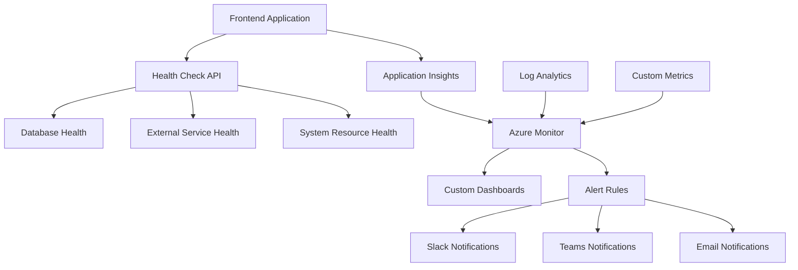

# 📊 Monitoring & Health Checks Guide

This comprehensive guide covers setting up monitoring, health checks, metrics collection, and alerting for Azure Static Web Apps across all environments.

## 📋 Table of Contents

1. [Overview](#overview)
2. [Health Check System](#health-check-system)
3. [Application Insights Integration](#application-insights-integration)
4. [Custom Metrics & Dashboards](#custom-metrics--dashboards)
5. [Alerting & Notifications](#alerting--notifications)
6. [Log Management](#log-management)
7. [Performance Monitoring](#performance-monitoring)
8. [Troubleshooting](#troubleshooting)

## 🎯 Overview

The monitoring system provides comprehensive observability across all environments with:

- **Real-time Health Monitoring** - API, database, and external service health
- **Performance Metrics** - Response time, throughput, and resource utilization
- **Custom Dashboards** - Environment-specific and aggregate views
- **Automated Alerting** - Slack, Teams, and email notifications
- **Log Analytics** - Centralized log collection and analysis

### Monitoring Architecture



## 🏥 Health Check System

### Frontend Health Check Component

The React application includes a comprehensive health check component that monitors all critical systems:

```javascript
// src/components/HealthCheck.js - Already implemented
import React, { useState, useEffect, useContext } from 'react';
import { HealthContext } from '../context/HealthContext';
import './HealthCheck.css';

function HealthCheck() {
  const {
    healthData,
    loading,
    error,
    refreshHealthData,
    startAutoRefresh,
    stopAutoRefresh
  } = useContext(HealthContext);

  // Health check implementation with real-time updates
  // See existing implementation in src/components/HealthCheck.js
}
```

### Backend Health Check API

Create a comprehensive health check API that the frontend consumes:

```javascript
// api/health.js (for Azure Functions or Node.js backend)
const express = require('express');
const router = express.Router();

// Health check endpoint
router.get('/health', async (req, res) => {
  const healthChecks = {
    timestamp: new Date().toISOString(),
    status: 'healthy',
    version: process.env.APP_VERSION || '1.0.0',
    environment: process.env.NODE_ENV || 'development',
    checks: {}
  };

  try {
    // Database health check
    healthChecks.checks.database = await checkDatabase();
    
    // External API health check
    healthChecks.checks.externalApis = await checkExternalApis();
    
    // Redis/Cache health check
    healthChecks.checks.cache = await checkCache();
    
    // Storage health check
    healthChecks.checks.storage = await checkStorage();
    
    // System resources
    healthChecks.checks.system = await checkSystemResources();

    // Overall status determination
    const allHealthy = Object.values(healthChecks.checks).every(
      check => check.status === 'healthy'
    );
    
    healthChecks.status = allHealthy ? 'healthy' : 'unhealthy';
    
    const statusCode = allHealthy ? 200 : 503;
    res.status(statusCode).json(healthChecks);
    
  } catch (error) {
    healthChecks.status = 'unhealthy';
    healthChecks.error = error.message;
    res.status(503).json(healthChecks);
  }
});

// Individual health check functions
async function checkDatabase() {
  try {
    // Replace with your database connection check
    // const result = await db.query('SELECT 1');
    return {
      status: 'healthy',
      responseTime: 15,
      lastChecked: new Date().toISOString()
    };
  } catch (error) {
    return {
      status: 'unhealthy',
      error: error.message,
      lastChecked: new Date().toISOString()
    };
  }
}

async function checkExternalApis() {
  const apis = [
    { name: 'PaymentAPI', url: 'https://api.payment.com/health' },
    { name: 'AuthAPI', url: 'https://api.auth.com/health' }
  ];
  
  const results = {};
  
  for (const api of apis) {
    try {
      const start = Date.now();
      const response = await fetch(api.url, { 
        method: 'GET',
        timeout: 5000 
      });
      const responseTime = Date.now() - start;
      
      results[api.name] = {
        status: response.ok ? 'healthy' : 'unhealthy',
        responseTime,
        httpStatus: response.status,
        lastChecked: new Date().toISOString()
      };
    } catch (error) {
      results[api.name] = {
        status: 'unhealthy',
        error: error.message,
        lastChecked: new Date().toISOString()
      };
    }
  }
  
  return results;
}

async function checkCache() {
  try {
    // Replace with your cache connection check
    // await redisClient.ping();
    return {
      status: 'healthy',
      responseTime: 5,
      lastChecked: new Date().toISOString()
    };
  } catch (error) {
    return {
      status: 'unhealthy',
      error: error.message,
      lastChecked: new Date().toISOString()
    };
  }
}

async function checkStorage() {
  try {
    // Replace with your storage check
    // await storageClient.listContainers();
    return {
      status: 'healthy',
      responseTime: 20,
      availableSpace: '85%',
      lastChecked: new Date().toISOString()
    };
  } catch (error) {
    return {
      status: 'unhealthy',
      error: error.message,
      lastChecked: new Date().toISOString()
    };
  }
}

async function checkSystemResources() {
  const os = require('os');
  
  return {
    status: 'healthy',
    cpu: {
      usage: Math.round((1 - os.loadavg()[0] / os.cpus().length) * 100),
      cores: os.cpus().length
    },
    memory: {
      total: Math.round(os.totalmem() / 1024 / 1024),
      free: Math.round(os.freemem() / 1024 / 1024),
      usage: Math.round((1 - os.freemem() / os.totalmem()) * 100)
    },
    uptime: os.uptime(),
    lastChecked: new Date().toISOString()
  };
}

module.exports = router;
```

### Health Check Automation

```bash
#!/bin/bash
# scripts/health-check.sh

PROJECT_NAME="myapp"
ENVIRONMENT="$1"

if [ -z "$ENVIRONMENT" ]; then
    echo "Usage: $0 <environment>"
    echo "Environments: dev, staging, preprod, prod"
    exit 1
fi

# Environment-specific URLs
case "$ENVIRONMENT" in
    "dev")
        BASE_URL="https://dev.yourdomain.com"
        ;;
    "staging")
        BASE_URL="https://staging.yourdomain.com"
        ;;
    "preprod")
        BASE_URL="https://preprod.yourdomain.com"
        ;;
    "prod")
        BASE_URL="https://yourdomain.com"
        ;;
    *)
        echo "Invalid environment: $ENVIRONMENT"
        exit 1
        ;;
esac

echo "🔍 Running health checks for $ENVIRONMENT environment"
echo "Base URL: $BASE_URL"

# Check main application
echo "Checking main application..."
HTTP_STATUS=$(curl -s -o /dev/null -w "%{http_code}" "$BASE_URL")
if [ "$HTTP_STATUS" = "200" ]; then
    echo "✅ Main application is healthy (HTTP $HTTP_STATUS)"
else
    echo "❌ Main application is unhealthy (HTTP $HTTP_STATUS)"
    exit 1
fi

# Check health endpoint
echo "Checking health endpoint..."
HEALTH_RESPONSE=$(curl -s "$BASE_URL/api/health")
HEALTH_STATUS=$(echo "$HEALTH_RESPONSE" | jq -r '.status' 2>/dev/null || echo "unknown")

if [ "$HEALTH_STATUS" = "healthy" ]; then
    echo "✅ Health endpoint reports healthy"
    echo "$HEALTH_RESPONSE" | jq .
else
    echo "❌ Health endpoint reports unhealthy or unavailable"
    echo "$HEALTH_RESPONSE"
    exit 1
fi

# Performance check
echo "Checking response time..."
RESPONSE_TIME=$(curl -w "%{time_total}" -s -o /dev/null "$BASE_URL")
THRESHOLD=2.0

if (( $(echo "$RESPONSE_TIME < $THRESHOLD" | bc -l) )); then
    echo "✅ Response time is acceptable ($RESPONSE_TIME seconds)"
else
    echo "⚠️ Response time is slow ($RESPONSE_TIME seconds)"
fi

echo "🎉 Health check completed for $ENVIRONMENT"
```

## 📈 Application Insights Integration

### Setup Application Insights

```bash
#!/bin/bash
# scripts/setup-application-insights.sh

PROJECT_NAME="myapp"
LOCATION="East US 2"
LOCATION_SHORT="eastus2"
environments=("dev" "staging" "preprod" "prod")

for env in "${environments[@]}"; do
    RG_NAME="${PROJECT_NAME}-rg-${env}-${LOCATION_SHORT}"
    AI_NAME="${PROJECT_NAME}-ai-${env}-${LOCATION_SHORT}"
    
    echo "Creating Application Insights: $AI_NAME"
    
    # Create Application Insights
    az monitor app-insights component create \
        --app "$AI_NAME" \
        --location "$LOCATION" \
        --resource-group "$RG_NAME" \
        --kind "web" \
        --application-type "web" \
        --retention-time 90 \
        --tags \
            Environment="$env" \
            Project="$PROJECT_NAME" \
            CreatedDate="$(date -u +%Y-%m-%d)"
    
    # Get instrumentation key
    INSTRUMENTATION_KEY=$(az monitor app-insights component show \
        --app "$AI_NAME" \
        --resource-group "$RG_NAME" \
        --query "instrumentationKey" \
        --output tsv)
    
    # Get connection string
    CONNECTION_STRING=$(az monitor app-insights component show \
        --app "$AI_NAME" \
        --resource-group "$RG_NAME" \
        --query "connectionString" \
        --output tsv)
    
    echo "Instrumentation Key: $INSTRUMENTATION_KEY"
    echo "Connection String: $CONNECTION_STRING"
    
    # Store in Key Vault
    KV_NAME="${PROJECT_NAME}-kv-${env}-${LOCATION_SHORT}"
    az keyvault secret set \
        --vault-name "$KV_NAME" \
        --name "ApplicationInsights-InstrumentationKey" \
        --value "$INSTRUMENTATION_KEY"
    
    az keyvault secret set \
        --vault-name "$KV_NAME" \
        --name "ApplicationInsights-ConnectionString" \
        --value "$CONNECTION_STRING"
    
    echo "✅ Application Insights $AI_NAME created and configured"
done
```

### Frontend Application Insights Integration

```javascript
// src/utils/analytics.js - Already implemented
import { ApplicationInsights } from '@microsoft/applicationinsights-web';
import { ReactPlugin } from '@microsoft/applicationinsights-react-js';

// Initialize Application Insights
let appInsights;
let reactPlugin;

export function initializeAppInsights() {
  const instrumentationKey = process.env.REACT_APP_APP_INSIGHTS_KEY;
  
  if (!instrumentationKey) {
    console.warn('Application Insights instrumentation key not found');
    return null;
  }

  reactPlugin = new ReactPlugin();
  appInsights = new ApplicationInsights({
    config: {
      instrumentationKey,
      extensions: [reactPlugin],
      extensionConfig: {
        [reactPlugin.identifier]: { history: window.history }
      },
      enableAutoRouteTracking: true,
      enableCorsCorrelation: true,
      enableRequestHeaderTracking: true,
      enableResponseHeaderTracking: true
    }
  });

  appInsights.loadAppInsights();
  appInsights.trackPageView();
  
  return { appInsights, reactPlugin };
}

// Custom tracking functions
export function trackEvent(name, properties = {}, measurements = {}) {
  if (appInsights) {
    appInsights.trackEvent({ name, properties, measurements });
  }
}

export function trackException(error, properties = {}) {
  if (appInsights) {
    appInsights.trackException({ 
      exception: error, 
      properties 
    });
  }
}

export function trackMetric(name, average, properties = {}) {
  if (appInsights) {
    appInsights.trackMetric({ name, average, properties });
  }
}
```

## 📊 Custom Metrics & Dashboards

### Custom Metrics Collection

```javascript
// src/utils/metricsCollector.js
class MetricsCollector {
  constructor() {
    this.metrics = new Map();
    this.startTime = Date.now();
  }

  // Collect performance metrics
  collectPerformanceMetrics() {
    if (window.performance && window.performance.getEntriesByType) {
      const navigation = window.performance.getEntriesByType('navigation')[0];
      
      const metrics = {
        pageLoadTime: navigation.loadEventEnd - navigation.fetchStart,
        domContentLoaded: navigation.domContentLoadedEventEnd - navigation.fetchStart,
        firstContentfulPaint: this.getFirstContentfulPaint(),
        largestContentfulPaint: this.getLargestContentfulPaint(),
        cumulativeLayoutShift: this.getCumulativeLayoutShift()
      };
      
      // Send to Application Insights
      Object.entries(metrics).forEach(([key, value]) => {
        if (value > 0) {
          trackMetric(`Performance.${key}`, value, {
            environment: getEnvironmentInfo().name,
            page: window.location.pathname
          });
        }
      });
      
      return metrics;
    }
  }

  // Collect business metrics
  collectBusinessMetrics() {
    const metrics = {
      activeUsers: this.getActiveUsers(),
      sessionsToday: this.getSessionsToday(),
      errorRate: this.getErrorRate(),
      conversionRate: this.getConversionRate()
    };
    
    Object.entries(metrics).forEach(([key, value]) => {
      trackMetric(`Business.${key}`, value, {
        environment: getEnvironmentInfo().name,
        timestamp: new Date().toISOString()
      });
    });
    
    return metrics;
  }

  // Helper methods for specific metrics
  getFirstContentfulPaint() {
    const paintEntries = window.performance.getEntriesByType('paint');
    const fcp = paintEntries.find(entry => entry.name === 'first-contentful-paint');
    return fcp ? fcp.startTime : 0;
  }

  getLargestContentfulPaint() {
    return new Promise((resolve) => {
      new PerformanceObserver((list) => {
        const entries = list.getEntries();
        const lastEntry = entries[entries.length - 1];
        resolve(lastEntry.startTime);
      }).observe({ entryTypes: ['largest-contentful-paint'] });
    });
  }

  getCumulativeLayoutShift() {
    let clsValue = 0;
    new PerformanceObserver((list) => {
      for (const entry of list.getEntries()) {
        if (!entry.hadRecentInput) {
          clsValue += entry.value;
        }
      }
    }).observe({ entryTypes: ['layout-shift'] });
    return clsValue;
  }
}

export const metricsCollector = new MetricsCollector();
```

### Azure Dashboard Creation

```bash
#!/bin/bash
# scripts/create-dashboard.sh

PROJECT_NAME="myapp"
SUBSCRIPTION_ID="your-subscription-id"
LOCATION_SHORT="eastus2"

# Create dashboard JSON
cat > dashboard-template.json << 'EOF'
{
  "lenses": {
    "0": {
      "order": 0,
      "parts": {
        "0": {
          "position": {
            "x": 0,
            "y": 0,
            "rowSpan": 4,
            "colSpan": 6
          },
          "metadata": {
            "inputs": [
              {
                "name": "resourceTypeMode",
                "isOptional": true
              },
              {
                "name": "ComponentId",
                "isOptional": true
              }
            ],
            "type": "Extension/HubsExtension/PartType/MonitorChartPart"
          }
        }
      }
    }
  },
  "metadata": {
    "model": {
      "timeRange": {
        "value": {
          "relative": {
            "duration": 24,
            "timeUnit": 1
          }
        },
        "type": "MsPortalFx.Composition.Configuration.ValueTypes.TimeRange"
      }
    }
  }
}
EOF

# Create dashboard for each environment
for env in dev staging preprod prod; do
    DASHBOARD_NAME="${PROJECT_NAME}-${env}-dashboard"
    RG_NAME="${PROJECT_NAME}-rg-${env}-${LOCATION_SHORT}"
    
    echo "Creating dashboard: $DASHBOARD_NAME"
    
    az portal dashboard create \
        --resource-group "$RG_NAME" \
        --name "$DASHBOARD_NAME" \
        --input-path dashboard-template.json \
        --location "$LOCATION_SHORT"
    
    echo "✅ Dashboard created for $env environment"
done

rm dashboard-template.json
```

### Custom Workbook Creation

```json
{
  "version": "Notebook/1.0",
  "items": [
    {
      "type": 1,
      "content": {
        "json": "# Application Health Dashboard\n\nThis workbook provides comprehensive monitoring for the Azure Static Web App across all environments."
      },
      "name": "text - 0"
    },
    {
      "type": 3,
      "content": {
        "version": "KqlItem/1.0",
        "query": "requests\n| where timestamp > ago(1h)\n| summarize count() by resultCode\n| render piechart",
        "size": 0,
        "title": "Request Status Distribution",
        "timeContext": {
          "durationMs": 3600000
        },
        "queryType": 0,
        "resourceType": "microsoft.insights/components"
      },
      "name": "query - 1"
    },
    {
      "type": 3,
      "content": {
        "version": "KqlItem/1.0",
        "query": "requests\n| where timestamp > ago(24h)\n| summarize avg(duration) by bin(timestamp, 1h)\n| render timechart",
        "size": 0,
        "title": "Average Response Time",
        "timeContext": {
          "durationMs": 86400000
        },
        "queryType": 0,
        "resourceType": "microsoft.insights/components"
      },
      "name": "query - 2"
    },
    {
      "type": 3,
      "content": {
        "version": "KqlItem/1.0",
        "query": "customMetrics\n| where name == \"Health.Check\"\n| where timestamp > ago(1h)\n| summarize avg(value) by bin(timestamp, 5m)\n| render timechart",
        "size": 0,
        "title": "Health Check Status",
        "timeContext": {
          "durationMs": 3600000
        },
        "queryType": 0,
        "resourceType": "microsoft.insights/components"
      },
      "name": "query - 3"
    }
  ],
  "fallbackResourceIds": [
    "/subscriptions/{subscription-id}/resourceGroups/{resource-group}/providers/microsoft.insights/components/{app-insights-name}"
  ]
}
```

## 🚨 Alerting & Notifications

### Alert Rules Setup

```bash
#!/bin/bash
# scripts/setup-alerts.sh

PROJECT_NAME="myapp"
SUBSCRIPTION_ID="your-subscription-id"
LOCATION_SHORT="eastus2"

# Create action group for notifications
ACTION_GROUP_NAME="${PROJECT_NAME}-alerts"
ACTION_GROUP_SHORT_NAME="alerts"

echo "Creating action group: $ACTION_GROUP_NAME"

az monitor action-group create \
    --resource-group "${PROJECT_NAME}-rg-prod-${LOCATION_SHORT}" \
    --name "$ACTION_GROUP_NAME" \
    --short-name "$ACTION_GROUP_SHORT_NAME" \
    --action email admin admin@yourdomain.com \
    --action webhook slack https://hooks.slack.com/services/YOUR/SLACK/WEBHOOK

# Get action group ID
ACTION_GROUP_ID=$(az monitor action-group show \
    --resource-group "${PROJECT_NAME}-rg-prod-${LOCATION_SHORT}" \
    --name "$ACTION_GROUP_NAME" \
    --query id \
    --output tsv)

echo "Action Group ID: $ACTION_GROUP_ID"

# Create alert rules for each environment
environments=("dev" "staging" "preprod" "prod")

for env in "${environments[@]}"; do
    RG_NAME="${PROJECT_NAME}-rg-${env}-${LOCATION_SHORT}"
    AI_NAME="${PROJECT_NAME}-ai-${env}-${LOCATION_SHORT}"
    
    echo "Creating alert rules for $env environment"
    
    # High error rate alert
    az monitor metrics alert create \
        --name "${AI_NAME}-high-error-rate" \
        --resource-group "$RG_NAME" \
        --scopes "/subscriptions/$SUBSCRIPTION_ID/resourceGroups/$RG_NAME/providers/microsoft.insights/components/$AI_NAME" \
        --condition "avg requests/failed > 5" \
        --window-size 5m \
        --evaluation-frequency 1m \
        --severity 2 \
        --action "$ACTION_GROUP_ID" \
        --description "Alert when error rate exceeds 5% in 5 minutes"
    
    # High response time alert
    az monitor metrics alert create \
        --name "${AI_NAME}-high-response-time" \
        --resource-group "$RG_NAME" \
        --scopes "/subscriptions/$SUBSCRIPTION_ID/resourceGroups/$RG_NAME/providers/microsoft.insights/components/$AI_NAME" \
        --condition "avg requests/duration > 2000" \
        --window-size 5m \
        --evaluation-frequency 1m \
        --severity 3 \
        --action "$ACTION_GROUP_ID" \
        --description "Alert when average response time exceeds 2 seconds"
    
    # Low availability alert
    az monitor metrics alert create \
        --name "${AI_NAME}-low-availability" \
        --resource-group "$RG_NAME" \
        --scopes "/subscriptions/$SUBSCRIPTION_ID/resourceGroups/$RG_NAME/providers/microsoft.insights/components/$AI_NAME" \
        --condition "avg availabilityResults/availabilityPercentage < 95" \
        --window-size 10m \
        --evaluation-frequency 5m \
        --severity 1 \
        --action "$ACTION_GROUP_ID" \
        --description "Alert when availability drops below 95%"
    
    echo "✅ Alert rules created for $env environment"
done
```

### Custom Alert Queries

```kusto
// High Error Rate Query
requests
| where timestamp > ago(5m)
| summarize 
    total = count(),
    errors = countif(success == false)
| extend errorRate = (errors * 100.0) / total
| where errorRate > 5

// Response Time Degradation
requests
| where timestamp > ago(10m)
| summarize avgDuration = avg(duration) by bin(timestamp, 1m)
| where avgDuration > 2000

// Health Check Failures
customEvents
| where name == "HealthCheck"
| where timestamp > ago(5m)
| where customDimensions.status == "unhealthy"
| summarize count() by tostring(customDimensions.service)

// Dependency Failures
dependencies
| where timestamp > ago(5m)
| where success == false
| summarize count() by name, resultCode
| where count_ > 3
```

### Slack Notification Integration

```javascript
// scripts/slack-notifier.js
const { WebClient } = require('@slack/web-api');

class SlackNotifier {
  constructor(token, channel) {
    this.slack = new WebClient(token);
    this.channel = channel;
  }

  async sendAlert(alert) {
    const blocks = [
      {
        type: "header",
        text: {
          type: "plain_text",
          text: `🚨 ${alert.severity} Alert: ${alert.name}`
        }
      },
      {
        type: "section",
        fields: [
          {
            type: "mrkdwn",
            text: `*Environment:*\n${alert.environment}`
          },
          {
            type: "mrkdwn",
            text: `*Status:*\n${alert.status}`
          },
          {
            type: "mrkdwn",
            text: `*Time:*\n${new Date(alert.timestamp).toLocaleString()}`
          },
          {
            type: "mrkdwn",
            text: `*Metric:*\n${alert.metric}`
          }
        ]
      },
      {
        type: "section",
        text: {
          type: "mrkdwn",
          text: `*Description:*\n${alert.description}`
        }
      }
    ];

    if (alert.actions) {
      blocks.push({
        type: "actions",
        elements: alert.actions.map(action => ({
          type: "button",
          text: {
            type: "plain_text",
            text: action.text
          },
          url: action.url,
          style: action.style || "primary"
        }))
      });
    }

    await this.slack.chat.postMessage({
      channel: this.channel,
      blocks
    });
  }

  async sendHealthSummary(healthData) {
    const status = healthData.status === 'healthy' ? '✅' : '❌';
    const color = healthData.status === 'healthy' ? 'good' : 'danger';

    await this.slack.chat.postMessage({
      channel: this.channel,
      attachments: [
        {
          color,
          title: `${status} Health Check Summary - ${healthData.environment}`,
          fields: Object.entries(healthData.checks).map(([service, check]) => ({
            title: service,
            value: `${check.status === 'healthy' ? '✅' : '❌'} ${check.status}`,
            short: true
          })),
          footer: "Health Check System",
          ts: Math.floor(Date.now() / 1000)
        }
      ]
    });
  }
}

module.exports = SlackNotifier;
```

## 📋 Log Management

### Log Analytics Workspace Setup

```bash
#!/bin/bash
# scripts/setup-log-analytics.sh

PROJECT_NAME="myapp"
LOCATION="East US 2"
LOCATION_SHORT="eastus2"

# Create Log Analytics Workspace
WORKSPACE_NAME="${PROJECT_NAME}-logs-${LOCATION_SHORT}"
RG_NAME="${PROJECT_NAME}-rg-prod-${LOCATION_SHORT}"

echo "Creating Log Analytics Workspace: $WORKSPACE_NAME"

az monitor log-analytics workspace create \
    --resource-group "$RG_NAME" \
    --workspace-name "$WORKSPACE_NAME" \
    --location "$LOCATION" \
    --sku PerGB2018 \
    --retention-time 30 \
    --tags \
        Project="$PROJECT_NAME" \
        Purpose="Centralized Logging" \
        CreatedDate="$(date -u +%Y-%m-%d)"

# Get workspace ID
WORKSPACE_ID=$(az monitor log-analytics workspace show \
    --resource-group "$RG_NAME" \
    --workspace-name "$WORKSPACE_NAME" \
    --query customerId \
    --output tsv)

echo "Log Analytics Workspace ID: $WORKSPACE_ID"

# Configure diagnostic settings for all Application Insights
environments=("dev" "staging" "preprod" "prod")

for env in "${environments[@]}"; do
    ENV_RG_NAME="${PROJECT_NAME}-rg-${env}-${LOCATION_SHORT}"
    AI_NAME="${PROJECT_NAME}-ai-${env}-${LOCATION_SHORT}"
    
    echo "Configuring diagnostic settings for $AI_NAME"
    
    az monitor diagnostic-settings create \
        --name "${AI_NAME}-diagnostics" \
        --resource "/subscriptions/$SUBSCRIPTION_ID/resourceGroups/$ENV_RG_NAME/providers/microsoft.insights/components/$AI_NAME" \
        --workspace "/subscriptions/$SUBSCRIPTION_ID/resourceGroups/$RG_NAME/providers/microsoft.operationalinsights/workspaces/$WORKSPACE_NAME" \
        --logs '[
          {
            "category": "AppAvailabilityResults",
            "enabled": true
          },
          {
            "category": "AppBrowserTimings",
            "enabled": true
          },
          {
            "category": "AppEvents",
            "enabled": true
          },
          {
            "category": "AppMetrics",
            "enabled": true
          },
          {
            "category": "AppDependencies",
            "enabled": true
          },
          {
            "category": "AppExceptions",
            "enabled": true
          },
          {
            "category": "AppPageViews",
            "enabled": true
          },
          {
            "category": "AppRequests",
            "enabled": true
          }
        ]'
    
    echo "✅ Diagnostic settings configured for $AI_NAME"
done
```

### Log Query Examples

```kusto
// Error Analysis
AppExceptions
| where TimeGenerated > ago(24h)
| summarize count() by ProblemId, ExceptionType
| order by count_ desc

// Performance Analysis
AppRequests
| where TimeGenerated > ago(1h)
| summarize 
    avg(DurationMs),
    percentile(DurationMs, 95),
    percentile(DurationMs, 99)
by bin(TimeGenerated, 5m)
| render timechart

// User Session Analysis
AppPageViews
| where TimeGenerated > ago(7d)
| summarize Sessions = dcount(SessionId) by bin(TimeGenerated, 1d)
| render timechart

// Dependency Health
AppDependencies
| where TimeGenerated > ago(1h)
| summarize 
    Total = count(),
    Failed = countif(Success == false),
    AvgDuration = avg(DurationMs)
by DependencyType, Name
| extend FailureRate = (Failed * 100.0) / Total
| order by FailureRate desc
```

## 🎯 Performance Monitoring

### Web Vitals Monitoring

```javascript
// src/utils/webVitals.js
import { getCLS, getFID, getFCP, getLCP, getTTFB } from 'web-vitals';
import { trackMetric } from './analytics';

function sendToAnalytics({ name, value, id }) {
  trackMetric(`WebVitals.${name}`, value, {
    metricId: id,
    environment: getEnvironmentInfo().name,
    page: window.location.pathname
  });
}

export function measureWebVitals() {
  getCLS(sendToAnalytics);
  getFID(sendToAnalytics);
  getFCP(sendToAnalytics);
  getLCP(sendToAnalytics);
  getTTFB(sendToAnalytics);
}

// Enhanced performance monitoring
export class PerformanceMonitor {
  constructor() {
    this.metrics = new Map();
    this.observers = new Map();
    this.setupObservers();
  }

  setupObservers() {
    // Resource timing observer
    if ('PerformanceObserver' in window) {
      const resourceObserver = new PerformanceObserver((list) => {
        for (const entry of list.getEntries()) {
          this.trackResourceTiming(entry);
        }
      });
      resourceObserver.observe({ entryTypes: ['resource'] });
      this.observers.set('resource', resourceObserver);
    }

    // Long task observer
    if ('PerformanceObserver' in window) {
      const longTaskObserver = new PerformanceObserver((list) => {
        for (const entry of list.getEntries()) {
          this.trackLongTask(entry);
        }
      });
      longTaskObserver.observe({ entryTypes: ['longtask'] });
      this.observers.set('longtask', longTaskObserver);
    }
  }

  trackResourceTiming(entry) {
    const resourceType = this.getResourceType(entry.name);
    
    trackMetric(`Performance.Resource.${resourceType}.Duration`, entry.duration, {
      resourceName: entry.name,
      transferSize: entry.transferSize,
      encodedBodySize: entry.encodedBodySize
    });
  }

  trackLongTask(entry) {
    trackMetric('Performance.LongTask.Duration', entry.duration, {
      startTime: entry.startTime,
      attribution: entry.attribution?.[0]?.name
    });
  }

  getResourceType(url) {
    if (url.includes('.js')) return 'JavaScript';
    if (url.includes('.css')) return 'CSS';
    if (url.includes('.png') || url.includes('.jpg') || url.includes('.svg')) return 'Image';
    if (url.includes('/api/')) return 'API';
    return 'Other';
  }

  startMeasurement(name) {
    this.metrics.set(name, performance.now());
  }

  endMeasurement(name, properties = {}) {
    const startTime = this.metrics.get(name);
    if (startTime) {
      const duration = performance.now() - startTime;
      trackMetric(`Performance.Custom.${name}`, duration, properties);
      this.metrics.delete(name);
      return duration;
    }
    return null;
  }

  measureFunction(name, fn) {
    return (...args) => {
      this.startMeasurement(name);
      const result = fn(...args);
      
      if (result instanceof Promise) {
        return result.finally(() => {
          this.endMeasurement(name);
        });
      } else {
        this.endMeasurement(name);
        return result;
      }
    };
  }
}

export const performanceMonitor = new PerformanceMonitor();
```

## 🔗 Related Documentation

- [Infrastructure Setup Guide](./01-INFRASTRUCTURE-SETUP.md)
- [Deployment Guide](./02-DEPLOYMENT-GUIDE.md)
- [Environment Configuration](./03-ENVIRONMENT-CONFIGURATION.md)
- [Troubleshooting Guide](./07-TROUBLESHOOTING.md)

---

**Last Updated:** December 2024  
**Version:** 1.0.0