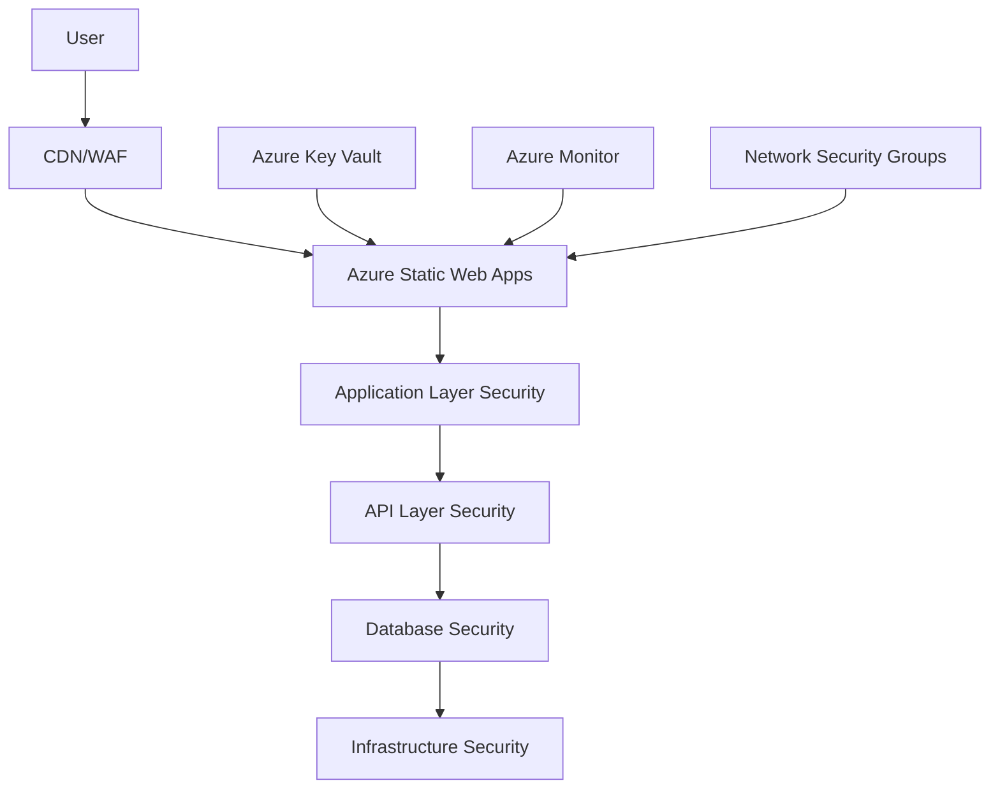

# 🔒 Security Best Practices Guide

This guide provides comprehensive security best practices for Azure Static Web Apps, including secure coding practices, infrastructure security, and operational security measures.

## 📋 Table of Contents

1. [Security Overview](#security-overview)
2. [Infrastructure Security](#infrastructure-security)
3. [Application Security](#application-security)
4. [Data Protection](#data-protection)
5. [Authentication & Authorization](#authentication--authorization)
6. [Network Security](#network-security)
7. [Monitoring & Incident Response](#monitoring--incident-response)
8. [Compliance & Governance](#compliance--governance)

## 🛡️ Security Overview

### Security Principles

This security framework follows the **CIA Triad** principles:

- **Confidentiality** - Protect sensitive data from unauthorized access
- **Integrity** - Ensure data accuracy and prevent unauthorized modification
- **Availability** - Maintain service accessibility for authorized users

### Defense in Depth Strategy



## 🏗️ Infrastructure Security

### Azure Resource Security

#### 1. **Resource Group Security**

```bash
#!/bin/bash
# scripts/secure-resource-groups.sh

PROJECT_NAME="myapp"
ENVIRONMENTS=("dev" "staging" "preprod" "prod")

for env in "${ENVIRONMENTS[@]}"; do
    RG_NAME="${PROJECT_NAME}-rg-${env}-eastus2"
    
    # Apply resource locks to prevent accidental deletion
    if [ "$env" = "prod" ]; then
        az lock create \
            --name "production-lock" \
            --resource-group "$RG_NAME" \
            --lock-type CanNotDelete \
            --notes "Prevents accidental deletion of production resources"
    fi
    
    # Apply tags for governance
    az group update \
        --name "$RG_NAME" \
        --tags \
            Environment="$env" \
            Project="$PROJECT_NAME" \
            DataClassification="Internal" \
            Owner="DevOps-Team" \
            CostCenter="IT" \
            Compliance="SOC2"
            
    echo "✅ Security applied to $RG_NAME"
done
```

#### 2. **Static Web App Security Configuration**

```bash
# Configure Static Web App security settings
for env in "${ENVIRONMENTS[@]}"; do
    RG_NAME="${PROJECT_NAME}-rg-${env}-eastus2"
    SWA_NAME="${PROJECT_NAME}-swa-${env}-eastus2"
    
    # Configure custom authentication (if needed)
    az staticwebapp update \
        --name "$SWA_NAME" \
        --resource-group "$RG_NAME" \
        --tags \
            SecurityScan="Enabled" \
            VulnerabilityAssessment="Monthly" \
            ComplianceFramework="SOC2,GDPR"
            
    echo "✅ Security configured for $SWA_NAME"
done
```

### Infrastructure as Code Security

#### Secure ARM Templates

```json
{
  "$schema": "https://schema.management.azure.com/schemas/2019-04-01/deploymentTemplate.json#",
  "contentVersion": "1.0.0.0",
  "parameters": {
    "environmentName": {
      "type": "string",
      "allowedValues": ["dev", "staging", "preprod", "prod"],
      "metadata": {
        "description": "Environment name for deployment"
      }
    },
    "projectName": {
      "type": "string",
      "minLength": 3,
      "maxLength": 10,
      "metadata": {
        "description": "Project name for resource naming"
      }
    }
  },
  "variables": {
    "staticWebAppName": "[concat(parameters('projectName'), '-swa-', parameters('environmentName'), '-eastus2')]",
    "keyVaultName": "[concat(parameters('projectName'), '-kv-', parameters('environmentName'), '-eastus2')]"
  },
  "resources": [
    {
      "type": "Microsoft.Web/staticSites",
      "apiVersion": "2021-01-15",
      "name": "[variables('staticWebAppName')]",
      "location": "East US 2",
      "sku": {
        "name": "Standard",
        "tier": "Standard"
      },
      "properties": {
        "buildProperties": {
          "skipGithubActionWorkflowGeneration": true
        }
      },
      "tags": {
        "Environment": "[parameters('environmentName')]",
        "Project": "[parameters('projectName')]",
        "SecurityCompliance": "Enabled"
      }
    }
  ]
}
```

## 🛡️ Application Security

### Secure Coding Practices

#### 1. **Input Validation & Sanitization**

```javascript
// src/utils/inputValidation.js
export class InputValidator {
  static sanitizeString(input) {
    if (typeof input !== 'string') {
      throw new Error('Input must be a string');
    }
    
    // Remove potentially dangerous characters
    return input
      .replace(/<script\b[^<]*(?:(?!<\/script>)<[^<]*)*<\/script>/gi, '')
      .replace(/javascript:/gi, '')
      .replace(/on\w+\s*=/gi, '')
      .trim();
  }
  
  static validateEmail(email) {
    const emailRegex = /^[^\s@]+@[^\s@]+\.[^\s@]+$/;
    return emailRegex.test(email);
  }
  
  static validateURL(url) {
    try {
      const urlObj = new URL(url);
      return ['http:', 'https:'].includes(urlObj.protocol);
    } catch {
      return false;
    }
  }
  
  static validateEnvironmentName(env) {
    const allowedEnvs = ['development', 'staging', 'pre-production', 'production'];
    return allowedEnvs.includes(env);
  }
}

// Usage in components
function SearchComponent({ onSearch }) {
  const handleSearch = (query) => {
    try {
      const sanitizedQuery = InputValidator.sanitizeString(query);
      if (sanitizedQuery.length < 100) { // Prevent excessively long queries
        onSearch(sanitizedQuery);
      }
    } catch (error) {
      console.error('Invalid search query:', error);
    }
  };
}
```

#### 2. **Content Security Policy (CSP)**

```html
<!-- public/index.html -->
<meta http-equiv="Content-Security-Policy" content="
  default-src 'self';
  script-src 'self' 'unsafe-inline' https://js.monitor.azure.com https://www.googletagmanager.com;
  style-src 'self' 'unsafe-inline';
  img-src 'self' data: https:;
  font-src 'self' https://fonts.gstatic.com;
  connect-src 'self' https://api.yourdomain.com https://dc.services.visualstudio.com;
  frame-ancestors 'none';
  base-uri 'self';
  form-action 'self';
">
```

#### 3. **Secure Environment Variable Handling**

```javascript
// src/utils/secureConfig.js
class SecureConfig {
  constructor() {
    this.validateEnvironmentVariables();
  }
  
  validateEnvironmentVariables() {
    const sensitivePatterns = [
      /password/i,
      /secret/i,
      /key/i,
      /token/i,
      /credential/i
    ];
    
    // Check for accidentally exposed sensitive data in client-side variables
    Object.keys(process.env).forEach(key => {
      if (key.startsWith('REACT_APP_')) {
        sensitivePatterns.forEach(pattern => {
          if (pattern.test(key)) {
            console.warn(`⚠️ Potentially sensitive environment variable: ${key}`);
          }
        });
      }
    });
  }
  
  getSecureConfig() {
    return {
      apiUrl: this.getApiUrl(),
      environment: this.getEnvironment(),
      version: process.env.REACT_APP_VERSION,
      buildId: process.env.REACT_APP_BUILD_ID,
      // Never expose actual secrets to client-side
      hasAnalytics: !!process.env.REACT_APP_APP_INSIGHTS_KEY
    };
  }
  
  getApiUrl() {
    const apiUrl = process.env.REACT_APP_API_URL;
    if (!apiUrl) {
      throw new Error('API URL not configured');
    }
    
    // Validate API URL
    if (!InputValidator.validateURL(apiUrl)) {
      throw new Error('Invalid API URL format');
    }
    
    return apiUrl;
  }
  
  getEnvironment() {
    const env = process.env.REACT_APP_ENV || 'development';
    if (!InputValidator.validateEnvironmentName(env)) {
      console.warn('Unknown environment name:', env);
      return 'development';
    }
    return env;
  }
}

export const secureConfig = new SecureConfig();
```

### XSS Prevention

```javascript
// src/utils/xssProtection.js
export class XSSProtection {
  static escapeHtml(unsafe) {
    return unsafe
      .replace(/&/g, "&amp;")
      .replace(/</g, "&lt;")
      .replace(/>/g, "&gt;")
      .replace(/"/g, "&quot;")
      .replace(/'/g, "&#039;");
  }
  
  static sanitizeProps(props) {
    const sanitized = {};
    
    Object.keys(props).forEach(key => {
      if (typeof props[key] === 'string') {
        sanitized[key] = this.escapeHtml(props[key]);
      } else {
        sanitized[key] = props[key];
      }
    });
    
    return sanitized;
  }
}

// Secure component wrapper
function SecureTextDisplay({ text, allowHtml = false }) {
  const displayText = allowHtml ? text : XSSProtection.escapeHtml(text);
  
  return (
    <div 
      dangerouslySetInnerHTML={allowHtml ? { __html: displayText } : undefined}
    >
      {!allowHtml && displayText}
    </div>
  );
}
```

## 🔐 Data Protection

### Encryption at Rest and in Transit

#### 1. **HTTPS Enforcement**

```javascript
// src/utils/httpsEnforcement.js
export function enforceHTTPS() {
  if (window.location.protocol !== 'https:' && window.location.hostname !== 'localhost') {
    window.location.href = 'https:' + window.location.href.substring(window.location.protocol.length);
  }
}

// Secure HTTP client
export class SecureHttpClient {
  constructor(baseURL) {
    this.baseURL = baseURL;
    this.defaultHeaders = {
      'Content-Type': 'application/json',
      'X-Requested-With': 'XMLHttpRequest'
    };
  }
  
  async request(endpoint, options = {}) {
    const url = new URL(endpoint, this.baseURL);
    
    // Ensure HTTPS for production
    if (process.env.REACT_APP_ENV === 'production' && url.protocol !== 'https:') {
      throw new Error('HTTPS required for production requests');
    }
    
    const requestOptions = {
      ...options,
      headers: {
        ...this.defaultHeaders,
        ...options.headers
      }
    };
    
    // Add CSRF protection
    if (['POST', 'PUT', 'DELETE'].includes(options.method?.toUpperCase())) {
      requestOptions.headers['X-CSRF-Token'] = this.getCSRFToken();
    }
    
    const response = await fetch(url, requestOptions);
    
    if (!response.ok) {
      throw new Error(`HTTP ${response.status}: ${response.statusText}`);
    }
    
    return response;
  }
  
  getCSRFToken() {
    return document.querySelector('meta[name="csrf-token"]')?.getAttribute('content');
  }
}
```

#### 2. **Client-Side Data Protection**

```javascript
// src/utils/dataProtection.js
export class DataProtection {
  static maskSensitiveData(data, fields = ['password', 'token', 'secret']) {
    const masked = { ...data };
    
    fields.forEach(field => {
      if (masked[field]) {
        masked[field] = '*'.repeat(8);
      }
    });
    
    return masked;
  }
  
  static logSecurely(message, data = {}) {
    const maskedData = this.maskSensitiveData(data);
    console.log(message, maskedData);
  }
  
  static clearSensitiveStorage() {
    // Clear potentially sensitive data from storage
    const sensitiveKeys = ['authToken', 'userSession', 'apiKey'];
    
    sensitiveKeys.forEach(key => {
      localStorage.removeItem(key);
      sessionStorage.removeItem(key);
    });
  }
}

// Session management
export class SecureSessionManager {
  static setSecureItem(key, value, expirationMinutes = 60) {
    const item = {
      value,
      expiry: Date.now() + (expirationMinutes * 60 * 1000),
      secure: true
    };
    
    sessionStorage.setItem(key, JSON.stringify(item));
  }
  
  static getSecureItem(key) {
    const itemStr = sessionStorage.getItem(key);
    
    if (!itemStr) {
      return null;
    }
    
    try {
      const item = JSON.parse(itemStr);
      
      if (Date.now() > item.expiry) {
        sessionStorage.removeItem(key);
        return null;
      }
      
      return item.value;
    } catch {
      sessionStorage.removeItem(key);
      return null;
    }
  }
}
```

### GDPR Compliance

```javascript
// src/utils/gdprCompliance.js
export class GDPRCompliance {
  static showCookieConsent() {
    const consent = localStorage.getItem('cookieConsent');
    
    if (!consent) {
      // Show cookie consent banner
      return {
        required: true,
        message: 'We use cookies to improve your experience and analyze usage.',
        categories: {
          necessary: { enabled: true, required: true },
          analytics: { enabled: false, required: false },
          marketing: { enabled: false, required: false }
        }
      };
    }
    
    return JSON.parse(consent);
  }
  
  static setCookieConsent(preferences) {
    localStorage.setItem('cookieConsent', JSON.stringify({
      ...preferences,
      timestamp: new Date().toISOString(),
      version: '1.0'
    }));
    
    // Configure analytics based on consent
    if (preferences.categories.analytics.enabled) {
      this.enableAnalytics();
    } else {
      this.disableAnalytics();
    }
  }
  
  static enableDataExport() {
    // Provide mechanism for users to export their data
    return {
      userProfile: this.getUserData(),
      sessions: this.getSessionData(),
      preferences: this.getPreferences()
    };
  }
  
  static enableDataDeletion() {
    // Provide mechanism for users to delete their data
    localStorage.clear();
    sessionStorage.clear();
    
    // Trigger server-side data deletion
    return fetch('/api/user/delete', {
      method: 'DELETE',
      headers: { 'Content-Type': 'application/json' }
    });
  }
}
```

## 🔑 Authentication & Authorization

### Secure Authentication Flow

```javascript
// src/utils/authentication.js
export class SecureAuthentication {
  constructor() {
    this.tokenKey = 'authToken';
    this.refreshTokenKey = 'refreshToken';
  }
  
  async login(credentials) {
    try {
      // Validate credentials client-side
      this.validateCredentials(credentials);
      
      const response = await fetch('/api/auth/login', {
        method: 'POST',
        headers: {
          'Content-Type': 'application/json',
          'X-CSRF-Token': this.getCSRFToken()
        },
        body: JSON.stringify(credentials)
      });
      
      if (!response.ok) {
        throw new Error('Authentication failed');
      }
      
      const { accessToken, refreshToken, expiresIn } = await response.json();
      
      // Store tokens securely
      SecureSessionManager.setSecureItem(this.tokenKey, accessToken, expiresIn / 60);
      SecureSessionManager.setSecureItem(this.refreshTokenKey, refreshToken, 7 * 24 * 60); // 7 days
      
      return { success: true };
    } catch (error) {
      DataProtection.logSecurely('Login failed:', { error: error.message });
      throw error;
    }
  }
  
  validateCredentials(credentials) {
    const { email, password } = credentials;
    
    if (!InputValidator.validateEmail(email)) {
      throw new Error('Invalid email format');
    }
    
    if (!password || password.length < 8) {
      throw new Error('Password must be at least 8 characters');
    }
  }
  
  logout() {
    SecureSessionManager.removeItem(this.tokenKey);
    SecureSessionManager.removeItem(this.refreshTokenKey);
    DataProtection.clearSensitiveStorage();
    
    // Redirect to login page
    window.location.href = '/login';
  }
  
  async refreshToken() {
    const refreshToken = SecureSessionManager.getSecureItem(this.refreshTokenKey);
    
    if (!refreshToken) {
      this.logout();
      return null;
    }
    
    try {
      const response = await fetch('/api/auth/refresh', {
        method: 'POST',
        headers: {
          'Content-Type': 'application/json',
          'Authorization': `Bearer ${refreshToken}`
        }
      });
      
      if (!response.ok) {
        this.logout();
        return null;
      }
      
      const { accessToken, expiresIn } = await response.json();
      SecureSessionManager.setSecureItem(this.tokenKey, accessToken, expiresIn / 60);
      
      return accessToken;
    } catch (error) {
      this.logout();
      return null;
    }
  }
}
```

### Role-Based Access Control

```javascript
// src/utils/authorization.js
export class Authorization {
  static roles = {
    ADMIN: 'admin',
    USER: 'user',
    VIEWER: 'viewer'
  };
  
  static permissions = {
    READ_DASHBOARD: 'read:dashboard',
    WRITE_SETTINGS: 'write:settings',
    MANAGE_USERS: 'manage:users',
    VIEW_HEALTH: 'view:health'
  };
  
  static rolePermissions = {
    [this.roles.ADMIN]: [
      this.permissions.READ_DASHBOARD,
      this.permissions.WRITE_SETTINGS,
      this.permissions.MANAGE_USERS,
      this.permissions.VIEW_HEALTH
    ],
    [this.roles.USER]: [
      this.permissions.READ_DASHBOARD,
      this.permissions.VIEW_HEALTH
    ],
    [this.roles.VIEWER]: [
      this.permissions.VIEW_HEALTH
    ]
  };
  
  static hasPermission(userRole, requiredPermission) {
    const userPermissions = this.rolePermissions[userRole] || [];
    return userPermissions.includes(requiredPermission);
  }
  
  static requirePermission(permission) {
    return function(Component) {
      return function ProtectedComponent(props) {
        const userRole = getCurrentUserRole(); // Implement this function
        
        if (!Authorization.hasPermission(userRole, permission)) {
          return <div>Access Denied</div>;
        }
        
        return <Component {...props} />;
      };
    };
  }
}

// Usage
const AdminDashboard = Authorization.requirePermission(
  Authorization.permissions.MANAGE_USERS
)(Dashboard);
```

## 🌐 Network Security

### API Security Configuration

```javascript
// src/utils/apiSecurity.js
export class APISecurityManager {
  constructor() {
    this.rateLimiter = new Map();
    this.maxRequestsPerMinute = 60;
  }
  
  checkRateLimit(endpoint) {
    const now = Date.now();
    const windowStart = now - 60000; // 1 minute window
    
    if (!this.rateLimiter.has(endpoint)) {
      this.rateLimiter.set(endpoint, []);
    }
    
    const requests = this.rateLimiter.get(endpoint);
    
    // Remove old requests outside the window
    const recentRequests = requests.filter(time => time > windowStart);
    
    if (recentRequests.length >= this.maxRequestsPerMinute) {
      throw new Error('Rate limit exceeded');
    }
    
    recentRequests.push(now);
    this.rateLimiter.set(endpoint, recentRequests);
  }
  
  async secureRequest(endpoint, options = {}) {
    // Check rate limiting
    this.checkRateLimit(endpoint);
    
    // Add security headers
    const secureOptions = {
      ...options,
      headers: {
        ...options.headers,
        'X-Requested-With': 'XMLHttpRequest',
        'X-API-Version': '1.0',
        'User-Agent': `${process.env.REACT_APP_PROJECT_NAME}/${process.env.REACT_APP_VERSION}`
      }
    };
    
    // Add authentication if available
    const token = SecureSessionManager.getSecureItem('authToken');
    if (token) {
      secureOptions.headers['Authorization'] = `Bearer ${token}`;
    }
    
    return fetch(endpoint, secureOptions);
  }
}
```

### Secure Communication

```javascript
// src/utils/secureCommunication.js
export class SecureCommunication {
  static validateResponse(response) {
    // Check for security headers
    const securityHeaders = {
      'X-Content-Type-Options': 'nosniff',
      'X-Frame-Options': 'DENY',
      'X-XSS-Protection': '1; mode=block',
      'Strict-Transport-Security': 'max-age=31536000; includeSubDomains'
    };
    
    Object.entries(securityHeaders).forEach(([header, expectedValue]) => {
      const actualValue = response.headers.get(header);
      if (!actualValue) {
        console.warn(`Missing security header: ${header}`);
      }
    });
  }
  
  static async fetchWithSecurity(url, options = {}) {
    const secureOptions = {
      ...options,
      mode: 'cors',
      credentials: 'same-origin',
      headers: {
        ...options.headers,
        'Cache-Control': 'no-cache',
        'Pragma': 'no-cache'
      }
    };
    
    const response = await fetch(url, secureOptions);
    this.validateResponse(response);
    
    return response;
  }
}
```

## 📊 Monitoring & Incident Response

### Security Event Monitoring

```javascript
// src/utils/securityMonitoring.js
export class SecurityMonitoring {
  static logSecurityEvent(eventType, details = {}) {
    const securityEvent = {
      type: eventType,
      timestamp: new Date().toISOString(),
      userAgent: navigator.userAgent,
      url: window.location.href,
      environment: process.env.REACT_APP_ENV,
      sessionId: this.getSessionId(),
      details: DataProtection.maskSensitiveData(details)
    };
    
    // Send to monitoring service
    this.sendToMonitoring(securityEvent);
  }
  
  static sendToMonitoring(event) {
    if (window.appInsights) {
      window.appInsights.trackEvent('SecurityEvent', event);
    }
    
    // Also log to console in development
    if (process.env.REACT_APP_ENV === 'development') {
      console.log('Security Event:', event);
    }
  }
  
  static monitorFailedLogins(attempts) {
    if (attempts >= 3) {
      this.logSecurityEvent('MULTIPLE_FAILED_LOGINS', {
        attempts,
        lockoutTime: Date.now() + (15 * 60 * 1000) // 15 minutes
      });
    }
  }
  
  static monitorSuspiciousActivity() {
    // Monitor for rapid page changes
    let pageChanges = 0;
    const startTime = Date.now();
    
    window.addEventListener('popstate', () => {
      pageChanges++;
      
      if (pageChanges > 20 && (Date.now() - startTime) < 30000) {
        this.logSecurityEvent('SUSPICIOUS_NAVIGATION', {
          pageChanges,
          timeWindow: Date.now() - startTime
        });
      }
    });
  }
  
  static getSessionId() {
    let sessionId = sessionStorage.getItem('securitySessionId');
    
    if (!sessionId) {
      sessionId = 'sess_' + Math.random().toString(36).substr(2, 9);
      sessionStorage.setItem('securitySessionId', sessionId);
    }
    
    return sessionId;
  }
}
```

### Incident Response Plan

```bash
#!/bin/bash
# scripts/security-incident-response.sh

SEVERITY="$1"  # critical, high, medium, low
INCIDENT_TYPE="$2"  # data-breach, unauthorized-access, ddos, malware

if [ -z "$SEVERITY" ] || [ -z "$INCIDENT_TYPE" ]; then
    echo "Usage: $0 <severity> <incident-type>"
    echo "Severity: critical, high, medium, low"
    echo "Types: data-breach, unauthorized-access, ddos, malware"
    exit 1
fi

echo "🚨 Security Incident Response Activated"
echo "Severity: $SEVERITY"
echo "Type: $INCIDENT_TYPE"

# Immediate response based on severity
case "$SEVERITY" in
    "critical")
        echo "⚠️ CRITICAL INCIDENT - Initiating emergency procedures"
        
        # Disable compromised services
        echo "🔒 Disabling affected services..."
        # az staticwebapp stop --name "myapp-swa-prod-eastus2" --resource-group "myapp-rg-prod-eastus2"
        
        # Rotate all secrets
        echo "🔄 Rotating security credentials..."
        # ./scripts/rotate-all-secrets.sh
        
        # Alert security team
        echo "📞 Alerting security team..."
        # Send high-priority alerts
        ;;
    "high")
        echo "⚠️ HIGH SEVERITY - Enhanced monitoring activated"
        
        # Increase monitoring frequency
        echo "📊 Increasing monitoring frequency..."
        
        # Review access logs
        echo "📋 Reviewing access logs..."
        ;;
    "medium"|"low")
        echo "ℹ️ Standard incident response procedures"
        
        # Standard logging and monitoring
        echo "📝 Logging incident for review..."
        ;;
esac

# Document incident
INCIDENT_ID="INC-$(date +%Y%m%d-%H%M%S)"
echo "📄 Incident ID: $INCIDENT_ID"

# Create incident log
cat > "incident-$INCIDENT_ID.log" << EOF
Incident ID: $INCIDENT_ID
Timestamp: $(date -u +"%Y-%m-%d %H:%M:%S UTC")
Severity: $SEVERITY
Type: $INCIDENT_TYPE
Detected By: Automated System
Status: Under Investigation

Timeline:
$(date -u +"%H:%M:%S") - Incident detected and response initiated

Actions Taken:
- Incident response script executed
- Monitoring enhanced
- Security team notified

Next Steps:
- Investigate root cause
- Implement containment measures
- Update security procedures
EOF

echo "✅ Incident response completed. Review incident-$INCIDENT_ID.log for details."
```

## 📋 Compliance & Governance

### Security Audit Checklist

```markdown
# Security Audit Checklist

## Infrastructure Security
- [ ] Resource groups have appropriate access controls
- [ ] Key Vault access policies are properly configured
- [ ] Network security groups restrict unnecessary access
- [ ] All resources have required tags and governance policies
- [ ] Production resources have deletion locks

## Application Security
- [ ] Content Security Policy (CSP) is implemented
- [ ] Input validation is implemented for all user inputs
- [ ] XSS protection is in place
- [ ] HTTPS is enforced in production
- [ ] Sensitive data is not exposed in client-side code

## Authentication & Authorization
- [ ] Secure authentication flow is implemented
- [ ] Role-based access control is enforced
- [ ] Session management is secure
- [ ] Token expiration and refresh is properly handled
- [ ] Failed login attempts are monitored

## Data Protection
- [ ] Data encryption in transit and at rest
- [ ] GDPR compliance measures are implemented
- [ ] Data retention policies are defined
- [ ] Secure data disposal procedures exist
- [ ] User consent management is in place

## Monitoring & Incident Response
- [ ] Security event monitoring is active
- [ ] Incident response procedures are documented
- [ ] Security alerts are configured
- [ ] Log retention and analysis capabilities exist
- [ ] Regular security assessments are scheduled

## Code Security
- [ ] Static code analysis tools are integrated
- [ ] Dependency vulnerability scanning is active
- [ ] Secret scanning is implemented
- [ ] Code review processes include security checks
- [ ] Security testing is part of CI/CD pipeline
```

### Compliance Frameworks

#### SOC 2 Compliance

```javascript
// src/utils/soc2Compliance.js
export class SOC2Compliance {
  static auditTrail = [];
  
  static logAccess(resource, action, user) {
    const logEntry = {
      timestamp: new Date().toISOString(),
      resource,
      action,
      user: DataProtection.maskSensitiveData({ user }),
      ip: this.getClientIP(),
      userAgent: navigator.userAgent,
      sessionId: SecurityMonitoring.getSessionId()
    };
    
    this.auditTrail.push(logEntry);
    
    // Send to compliance monitoring
    this.sendToComplianceLog(logEntry);
  }
  
  static sendToComplianceLog(entry) {
    if (window.appInsights) {
      window.appInsights.trackEvent('ComplianceAudit', entry);
    }
  }
  
  static generateComplianceReport() {
    return {
      period: {
        start: new Date(Date.now() - 30 * 24 * 60 * 60 * 1000).toISOString(),
        end: new Date().toISOString()
      },
      accessLogs: this.auditTrail,
      securityControls: this.getSecurityControls(),
      dataProcessing: this.getDataProcessingActivities()
    };
  }
  
  static getSecurityControls() {
    return {
      encryption: {
        inTransit: true,
        atRest: true
      },
      accessControl: {
        authentication: true,
        authorization: true,
        roleBasedAccess: true
      },
      monitoring: {
        securityEvents: true,
        accessLogging: true,
        incidentResponse: true
      }
    };
  }
}
```

## 🔗 Related Documentation

- [Infrastructure Setup Guide](./01-INFRASTRUCTURE-SETUP.md)
- [Azure Key Vault Integration](./04-AZURE-KEYVAULT-INTEGRATION.md)
- [PR Protection Guide](./06-PR-PROTECTION-GUIDE.md)
- [Monitoring Guide](./05-MONITORING-GUIDE.md)

---

**Last Updated:** December 2024  
**Version:** 1.0.0  
**Security Framework:** SOC 2, GDPR Compliant