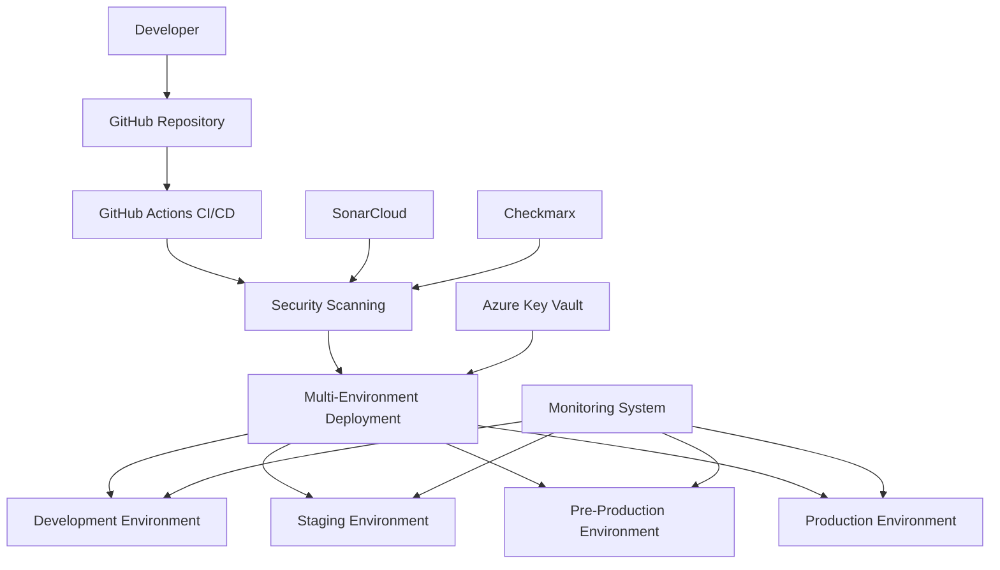

# 📚 Azure Static Web Apps - Comprehensive Documentation

Welcome to the complete documentation for the Azure Static Web Apps deployment system with multi-environment support, monitoring, and security integration.

## 🎯 Quick Start

1. **[Infrastructure Setup](./01-INFRASTRUCTURE-SETUP.md)** - Create Azure resources for all environments
2. **[Deployment Guide](./02-DEPLOYMENT-GUIDE.md)** - Deploy applications across environments
3. **[Environment Configuration](./03-ENVIRONMENT-CONFIGURATION.md)** - Configure environment-specific settings
4. **[Azure Key Vault Integration](./04-AZURE-KEYVAULT-INTEGRATION.md)** - Manage secrets across environments
5. **[Monitoring & Health Checks](./05-MONITORING-GUIDE.md)** - Set up monitoring and alerting
6. **[PR Protection & Security](./06-PR-PROTECTION-GUIDE.md)** - Configure security scanning and protection
7. **[Troubleshooting](./07-TROUBLESHOOTING.md)** - Common issues and solutions

## 📋 Documentation Overview

### 🏗️ Infrastructure & Setup
- **[Infrastructure Setup](./01-INFRASTRUCTURE-SETUP.md)** - Complete Azure infrastructure creation for all environments
- **[Environment Configuration](./03-ENVIRONMENT-CONFIGURATION.md)** - Frontend configuration management and deployment variables

### 🚀 Deployment & Operations
- **[Deployment Guide](./02-DEPLOYMENT-GUIDE.md)** - Deployment processes with scenario-based examples
- **[Azure Key Vault Integration](./04-AZURE-KEYVAULT-INTEGRATION.md)** - Secret management across environments
- **[Monitoring Guide](./05-MONITORING-GUIDE.md)** - Health checks, metrics, and alerting setup

### 🛡️ Security & Quality
- **[PR Protection Guide](./06-PR-PROTECTION-GUIDE.md)** - SonarCloud, Checkmarx, and branch protection
- **[Security Best Practices](./08-SECURITY-BEST-PRACTICES.md)** - Security guidelines and recommendations

### 🔧 Maintenance & Support
- **[Troubleshooting Guide](./07-TROUBLESHOOTING.md)** - Common issues and step-by-step solutions
- **[Operations Runbook](./09-OPERATIONS-RUNBOOK.md)** - Day-to-day operations and maintenance
- **[API Reference](./10-API-REFERENCE.md)** - Complete API documentation
- **[Migration to Managed Identity](./11-MIGRATION-TO-MANAGED-IDENTITY.md)** - Guide for migrating from service principal to managed identity
- **[Configurable Thresholds](./12-CONFIGURABLE-THRESHOLDS.md)** - Complete guide to security and quality threshold configuration
- **[Versioning Strategy](./13-VERSIONING-STRATEGY.md)** - Environment-specific versioning and release management
- **[Production-Grade Deployment](./14-PRODUCTION-GRADE-DEPLOYMENT.md)** - Enterprise deployment strategies and security controls

## 🚀 System Architecture

## 🌟 Key Features

### ✅ **Multi-Environment Support**
- **Development** - Feature development and testing
- **Staging** - Integration testing and UAT
- **Pre-Production** - Production-like testing
- **Production** - Live application serving users

### ✅ **Security Integration**
- **SonarCloud** - Code quality and security analysis
- **Checkmarx** - SAST security vulnerability scanning
- **Azure Key Vault** - Centralized secret management
- **Branch Protection** - Configurable PR protection rules

### ✅ **Monitoring & Health Checks**
- **Real-time Health Monitoring** - API, database, external services
- **Performance Metrics** - Response time, uptime, resource usage
- **Automated Alerting** - Slack, Teams, email notifications
- **Dashboard Interface** - Visual monitoring and management

### ✅ **Deployment Features**
- **Automated CI/CD** - GitHub Actions workflows
- **Semantic Versioning** - Automated version management
- **Rollback Capabilities** - Quick deployment rollbacks
- **Deployment History** - Complete deployment tracking

## 🎯 Prerequisites

Before starting, ensure you have:

- **Azure Subscription** with appropriate permissions
- **GitHub Account** with repository access
- **Azure CLI** installed and configured
- **Node.js 18+** for local development
- **SonarCloud Account** (optional, for code quality)
- **Checkmarx Account** (optional, for security scanning)

## 🔗 Quick Links

| Resource | Description | Link |
|----------|-------------|------|
| **GitHub Repository** | Source code and workflows | [GitHub](https://github.com/abhiksd/azure-static-webapp-ci) |
| **Azure Portal** | Manage Azure resources | [Azure Portal](https://portal.azure.com) |
| **SonarCloud** | Code quality analysis | [SonarCloud](https://sonarcloud.io) |
| **Checkmarx** | Security scanning | [Checkmarx](https://checkmarx.com) |

## 📞 Support

For questions or issues:

1. **Check the [Troubleshooting Guide](./07-TROUBLESHOOTING.md)** first
2. **Review the [Operations Runbook](./09-OPERATIONS-RUNBOOK.md)** for common procedures
3. **Search existing GitHub Issues** for similar problems
4. **Create a new GitHub Issue** with detailed information

## 🔄 Document Updates

This documentation is version-controlled alongside the codebase. When making changes:

1. Update the relevant documentation files
2. Test the procedures described
3. Update version numbers and dates
4. Submit a pull request for review

---

**Last Updated:** December 2024  
**Version:** 1.0.0  
**Maintained by:** Azure Static Web Apps Team